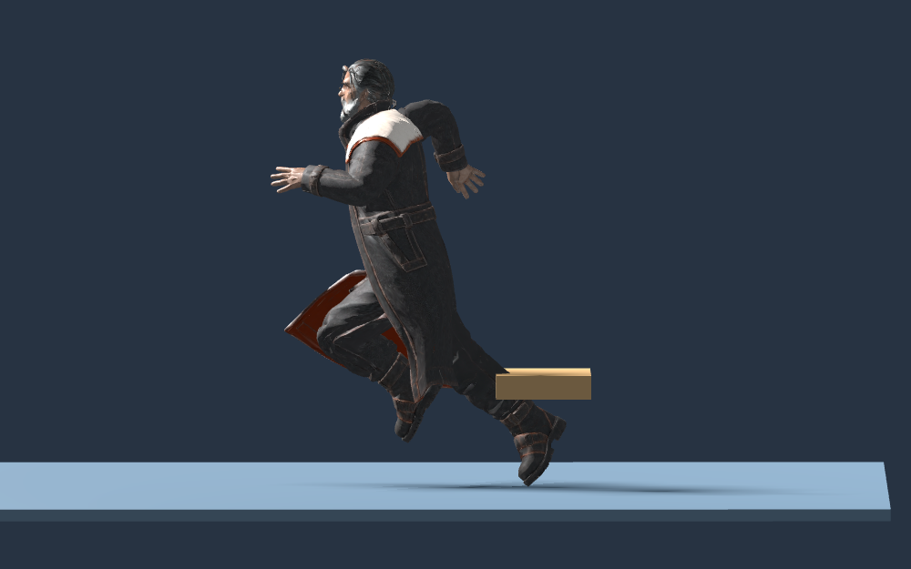

# Character visual guide

This reference preserves reusable production lessons without requiring a local
production archive. It does not contain paid source downloads, generation logs,
or enough material to recreate an exact historical build.

## Identity and rigs

Use readable silhouettes and practical manufactured details, with restrained
ivory, teal, graphite, brass and coral accents. Preserve baked PBR texture detail.
Roles belong to equipment and labels; costume changes do not change assignments
or permissions. A newly generated interpretation is not the original reference mesh.

Inspect each model's geometry, omitted glTF material defaults, axes, dimensions,
skeleton, bind/rest transforms and clips. Author animation against its own rig.
Independent characters must not silently borrow another body's animation library.
Preserve corrective blendshapes and explicit zero-weight resets across transitions.

## Outfit and hair preparation

Fit rigid accessories to actual torso, shoulder or hip bones; measure clearance
against evaluated mesh geometry rather than bone coordinates alone. Bevel panel
edges and use restrained fasteners, inserts and asymmetry for camera-scale detail.
Protect hair and skin from blanket recoloring with an explicit mask. Hair motion
composes with imported local rest rotations and resets to rest under reduced
motion. It is bounded cosmetic motion, not full strand collision simulation.

## Grounding

This selected native test frame shows the deformed boot sole at the support plane.
The tan block is a test-scene seat, not part of the character. Compare front and
side views across standing, walk, run, sit, and transitions; one frame cannot prove
all-phase contact or rule out sliding. Preserve airborne phases and seated contact.
Do not infer grounding from ankle or pelvis coordinates alone.

The current flat-colony correction samples low walkable supports up to 0.35 m,
raises only the visual presentation, and leaves planar navigation unchanged. It
is not terrain IK or horizontal foot locking. New slopes or elevated floors need
an explicit contract extension and physical qualification.

## Provenance

Keep source identifiers, output hashes, tool versions and the runtime connection
with production records. This guide and its bundled image explain the method;
they do not replace exact-build provenance. If local source archives are absent,
inspect committed runtime models and report that exact source reconstruction is
unverified. Never imply that a reference image grants generation or deployment
authority. Technical checks and owner art acceptance remain separate.
