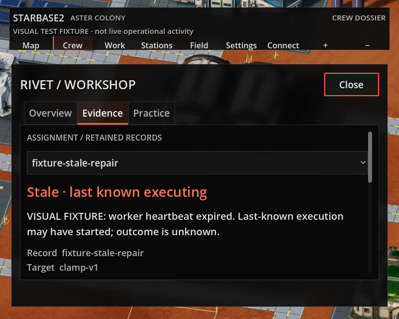

# Visual review examples

Use this bundled example when checking retained state and compact layouts. It
requires no local evidence archive. It illustrates a review case, not a golden
pixel test or proof that the current build passes.

The synthetic record explicitly says stale and last-known executing. Do not turn
an expired heartbeat into success, failure, or a fresh running state. Verify that
record identity, selected evidence, and cancellation eligibility remain tied to
the same authoritative record after changing crew, tabs, or history pages.

Repeat at 800×640 with large text using keyboard input: open crew, switch to
Evidence, reach the selector and any available action, scroll to all metadata,
and close the panel. Scroll containers should follow focused controls. Never
validate only the first visible portion of a long record.

For new work, capture the same framing before and after the change, retain failures
locally, and record observed limitations. Keep only reusable, sanitized examples
in skill assets; raw captures and logs stay outside the published skill. Check
actual model contact over time separately from this static UI example.
