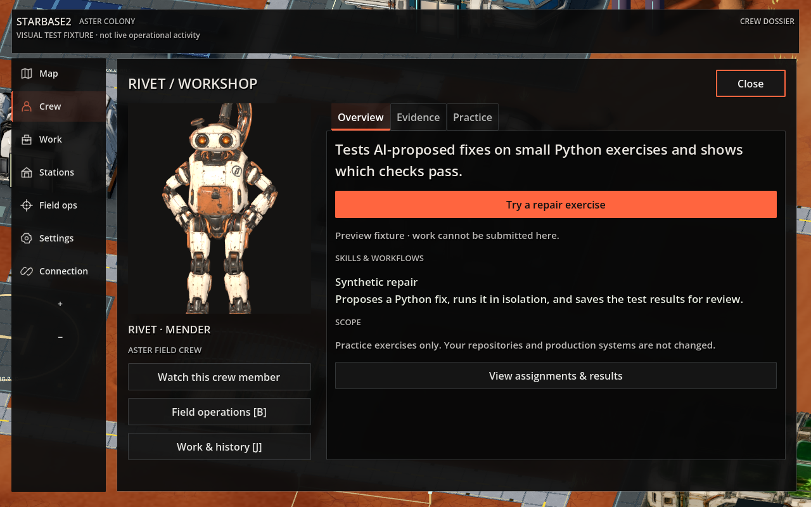
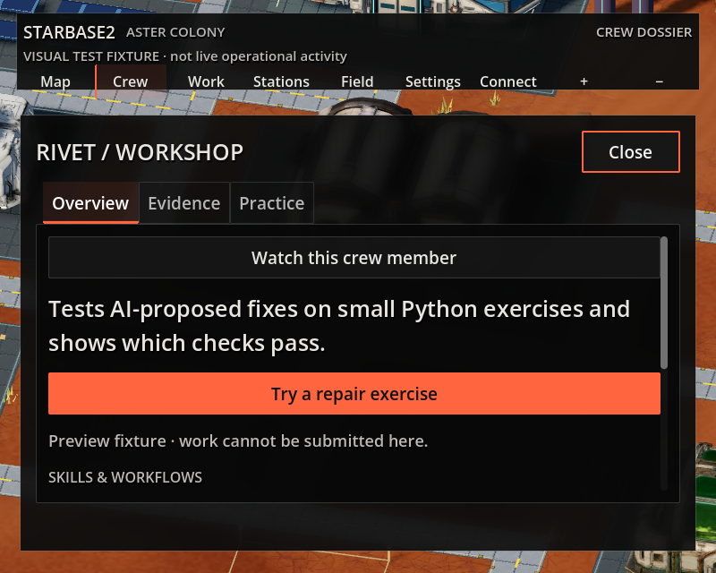

# Visual guide

These bundled examples are sufficient to understand the visual intent without
local capture archives. They are selected references, not a certification of a
future build. Use current source and native captures to assess changed behavior.

## Crew overview

Lead with purpose, then a task-specific action, availability, skills/workflows,
and scope. Keep raw record IDs and cancellation with results in Evidence. Opening
a form must not submit work. A role description does not establish an installed
skill package, proficiency, or permission. The pictured data is a synthetic fixture.

At 800×640 with large text, let the content scroll, preserve visible tabs and a
close action, and keep keyboard focus reachable. Hiding the portrait is acceptable;
hiding the crew's purpose or primary action is not. Check the content below the
fold rather than squeezing everything into smaller text.

## Inhabited Habitat

This is an AI-generated aspiration, not implemented gameplay or a current crew
roster. Use its warm ivory, teal, brass and terracotta palette, readable silhouettes,
soft morning lighting, and practical furnishings as composition guidance. Do not
copy its generated text, older character designs, or depicted UI as requirements.
Preserve door clearance and the existing room footprint when adapting atmosphere.

Observe mode and decorative activity should feel calm without implying agent work.
A daybook presents retained reports with freshness; it does not claim complete
history. Reduced motion should freeze decorative movement and return control from
camera directing. Work must never wait for travel, a pose, or a camera shot.

The bundled visual-manifest.json records image hashes and whether each is a
fixture capture or art target. No production screenshots or operational data are
included. Full local production history is not needed to use this guide.
