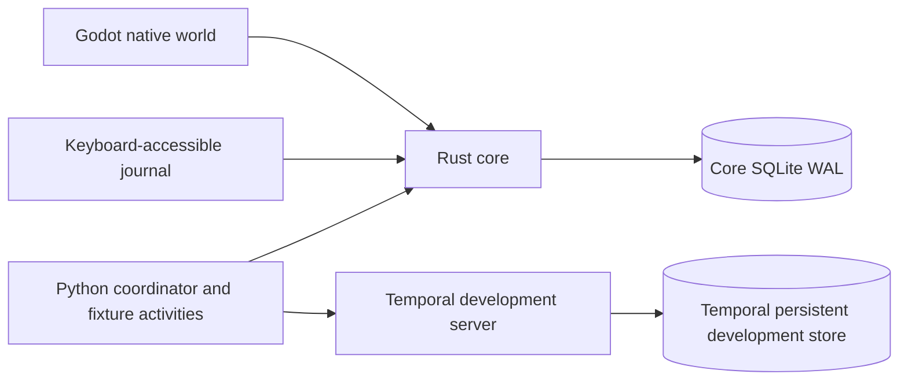

# Architecture and current implementation

Status: proposed

## Implemented local repair extension · 2026-09-05

The local repair extension adopts pinned microsandbox microVMs, a core-owned action/credit ledger and a V3 Temporal workflow. It adds no service or datastore. See [ADR 0004](adr/0004-isolated-repairs-and-progression.md) and [repair operations](repairs.md). Earlier read-only boundary descriptions apply to Surveyor/V2, not the isolated repair extension.

The production architecture remains open. [ADR 0002](adr/0002-local-walking-slice.md)
accepts the smaller **local** implementation below; it does not accept all of
[ADR 0001](adr/0001-starbase2-foundation.md).

## Current operations extension

[ADR 0003](adr/0003-local-operations.md) extends the same owners with real read-only
Python review, immutable masked source snapshots and typed reports, bounded active
queues plus paged history, durable recurring reviews, local operator/worker write
credentials, and separately labeled model advice. [Operations](operations.md)
describes implemented v2 semantics and measured limits. No new service or datastore
was required. v1 stays available for compatibility and the original experiment.

## Original local slice (v1, retained for compatibility)

| Owner | Implemented responsibility | Durable records |
|---|---|---|
| Rust core | Mission identity, pending intent, state transitions, trusted public-fixture grader, retained evidence, snapshot, journal | One SQLite database, initial migration, immutable evidence triggers |
| Python runtime | Stable workflow dispatch, bounded activities, build checks, cancellation reconciliation, direct/PydanticAI-integration experiment | Temporal histories; results submitted through core API |
| Clients | Playable Godot outpost and structured HTML journal | No product state; snapshots from the core |

The fixture source is an in-process adapter, not a Connector service. Evidence
is a module in its owning core, not an independently deployed service. A separate
Evidence owner may become justified by independent credentials and administration;
separate tables and binaries alone would not establish isolation.

## Execution and failure semantics

1. `just demo` submits a frozen baseline/candidate pair and mission identity.
   The mission row is durable dispatch intent. Exact duplicates return the same
   identity; changed input under that ID is rejected.
2. The Python coordinator polls nonterminal missions and starts
   `starbase2-<mission-id>` with a reject-duplicate reuse policy. Crash between
   start and observation is reconciled against that same Temporal workflow.
3. Preparation validates the loaded worker's frozen build manifests. Every run
   stays bound to its source, lockfile, prompt, fixtures, runtime, and model facts.
   Only the two fixture builds are executable.
4. Six paired trials run with explicit activity attempts, deadlines, and model
   request limits. The fake model performs no external I/O. A worker restart may
   rerun an interrupted activity; it does not create another logical mission.
5. Rust grades each trial against its own fixture contract. An invalid baseline
   invalidates the comparison; candidate citation hard-gate failures are ineligible.
   Completion and all evidence commit atomically. Exact result resubmission is
   idempotent; changed evidence is rejected.
6. Stop first records `cancel_requested`, fencing late success. The coordinator
   requests Temporal cancellation and reconciles its terminal status. Temporal
   failure remains failure even when stop was requested. Missing acknowledgement
   remains pending/stale; no client animation certifies it.

Clients poll a full bounded snapshot once a second. Five seconds without a
running/queued update marks that record stale. Client transport failure preserves
last-known data as disconnected, and completion without evidence is unknown.
Terminal evidence remains historical when the connection is lost. There is no
replayed success animation. Backend progress is independent of scene travel.

The v1 experiment limits retention to 100 missions. The current server permits 2 MiB command
bodies, rejecting overflow explicitly. It uses a synchronous SQLite connection
behind one mutex. This is an intentional small-load limit, not a scalable server
claim. Pagination, queues, multi-replica storage, and throughput are unmeasured.

## Contract and trust boundaries

Rust types generate [JSON Schema](../contracts/core.schema.json) and Python wire
models. Snapshot readers tolerate additive fields; command objects reject unknown
fields. v1 remains supported; new operational clients use the additive v2 contract. No framework for generic event routing,
foreign database reads, generated services, or synchronous service fan-out exists.

Everything binds to loopback. The local API has no authenticated roles and must
not be exposed remotely. There are no provider tokens, tools, arbitrary-code
execution, hidden tests, or qualified sandbox boundaries. The Rust grader is
outside the fake candidate function, but local administrator tampering is not
prevented. Do not interpret fixture results as operational qualifications.

## Deferred production choices

PostgreSQL remains the leading production store to investigate, including Kubani's
shared infrastructure. Before adopting it, implement owned migrations, identity,
connection budgets, backup/restore, and multi-instance transaction tests.
Temporal's development server is never the deployment topology.

Introduce a separate observer/connector owner only when provider identities,
checkpoint load, or independent lifecycle justify it. An external Effector needs
its own narrow identity, idempotency ledger, exact target/revision validation,
and outcome reconciliation before any writes are enabled.

FalkorDB requires a demonstrated query that an SQL baseline cannot adequately
serve. MCP requires an actual integration consumer; agentgateway requires repeated
routing/identity work that warrants operating it. Neither is needed in this slice.

Kubani remains the deployment authority. No namespace, manifests, cluster state,
predecessor service, or production database was changed. Deployment and arbitrary
candidate execution require the separate gates in the [roadmap](roadmap.md).

## Playable native client extension

The [Aster art pass](world-playable.md) adds client-side navigation, original
assets and contextual controls without another service or datastore. Native
repair creation/cancellation uses the existing loopback operator cookie in
memory, never a worker identity. Pending commands are fenced; uncertain writes
are reconciled with GET rather than automatically repeated. The core retains
authoritative work, evaluation and progression state; movement remains decorative.

## Fresh Kubani deployment preparation

The [setup, rollback, recovery and teardown playbook](deployment.md) prepares a fresh
PostgreSQL-backed installation. Local SQLite and local Temporal histories are
development-only and are not imported. The private deployment bundle starts
stopped, with provider inference, legacy fixture API and unqualified sandbox
repairs disabled. Cluster/image qualification and platform backup restoration
remain required before activation; no Kubani deployment has been performed.

## Field agent and memory extension

[ADR 0006](adr/0006-field-agents-and-reviewed-memory.md) adds two read-only field
agents to the existing worker/core, with a Graphiti/FalkorDB episodic projection.
SQL remains the approval and evidence authority; no new Starbase2 service owns
memory. [The implementation guide](field-agents.md) distinguishes structured
recall from deferred semantic extraction and production activation.
