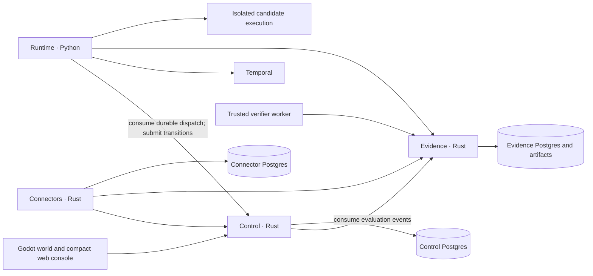

# Architecture proposal

Status: proposed

## Four services to begin

Build one product monorepo with four service owners. Independent release,
identity, and failure boundaries matter more than a large service count.

| Service | Language | Owns | Persistent state |
|---|---|---|---|
| Control | Rust | Crew/build registry, duties, findings, Missions, policy decisions, operator API, world projection | Its own PostgreSQL database, journal, dispatch outbox, and consumer checkpoints |
| Runtime | Python | Temporal workflow definitions, PydanticAI agent composition, campaign orchestration, trusted worker lifecycle | Temporal histories; durable product results submitted through owner APIs |
| Evidence | Rust | Artifact storage/access, immutable trial records, verifier attestations, comparison records | Its own PostgreSQL database and protected content storage |
| Connectors | Rust | Provider observation, normalization, checkpoints, scoped tool adapters | Its own PostgreSQL database for checkpoints and delivery outbox |

Control intentionally merges several predecessor ownership boundaries into
one cohesive work-management service. Its modules are ordinary modules, not
twenty nominal microservices sharing a binary. This reduces contracts and
cross-owner transactions but enlarges Control's failure domain. Split a module
when credentials, independent release needs, measured load, or ownership
justify it. The Evidence and Connector boundaries already justify isolation.

Runtime is an execution service, not a database owner for crew and Missions.
Campaign request configuration belongs to Control; frozen trial contracts and
results belong to Evidence; Temporal owns execution progress. Only a trusted
verifier identity may submit final evaluation attestations. Candidate activity
workers cannot forge them or overwrite results.

This is a proposed logical dependency diagram, updated 2026-09-05. Arrows show
API/dependency use, not an assertion of instantaneous event delivery. Each
database has exactly one owner. UI requests reach Control; Control serves its
own projection without synchronous fan-out on the world snapshot path.

## Execution and event flow

1. A connector uploads bounded source evidence, then commits its normalized
   observation and outbox record locally. It retries Control ingestion using
   the same observation identity; lost acknowledgments cannot duplicate it.
2. Control atomically records the finding, policy-eligible Mission, and
   dispatch intent. Creating a finding alone never grants execution authority.
3. A Python dispatcher consumes the authenticated Control dispatch feed and
   starts a workflow with a stable Mission-derived workflow ID. It acknowledges
   only after start or verified already-started. A crash in between is safe.
4. Workflow activities invoke the pinned agent build and submit idempotent
   progress transitions. Control checks actor, expected version, and run ID.
5. Evidence retains outputs and trusted evaluation attestations. Its own
   journal/outbox makes results recoverable; Control consumes a bounded feed
   into its projection. No consumer reads another owner's tables.
6. The client loads a snapshot and applies updates with a cursor. A gap or
   expired cursor triggers resnapshot; reconnect never replays an old success
   celebration as if it happened now.

Use checked-in OpenAPI and JSON Schema with generated Rust/Python clients and
shared JSON fixtures for Godot. Keep payloads bounded and carry artifact
references. HTTP commands return an operation ID. Durable owner feeds provide
at-least-once delivery, consumer checkpoints, and explicit retention gaps.
Begin with bounded polling; add SSE on the operator surface if it improves the
measured experience. PostgreSQL NOTIFY may wake a poller but is not durability.
Do not introduce NATS, Kafka, GraphQL, or a general event-routing framework.

An artifact upload followed by a domain commit can leave an unreferenced
artifact. Use upload receipts and a reference-registration grace period;
garbage collection checks durable references before deleting anything.

## Python and Temporal

Use Python for both agent composition and workflow orchestration. Evaluate
PydanticAI's maintained Temporal integration in the first spike. It separates
model and tool operations into activities; retry settings must be explicitly
bounded across transport, model client, and Temporal layers.
[PydanticAI documentation](https://pydantic.dev/docs/ai/capabilities/durable_execution/temporal/)

Rust handles APIs, policy validation, ingestion, and storage. Do not require a
Rust Temporal worker to make the initial design work. The upstream Rust SDK
now documents native workflows and activities, with some APIs behind an
experimental feature; it is a viable later comparison, not proof of a missing
Rust ecosystem. Keeping the agent/workflow lifecycle together currently removes
a language boundary. [Rust SDK documentation](https://github.com/temporalio/sdk-rust/blob/main/crates/sdk/README.md)

Temporal is used heavily where durability matters: Mission execution,
multi-step investigations, evaluations, approval waits, cancellation, and
recurring duty schedules. It is not the world database or a topic bus. Rust
connectors maintain Kubernetes watches and cheap reconciliation loops; they do
not start workflows for every animation or every low-level event.

Use one bounded child workflow per run. Pin builds before execution. Keep
side effects out of deterministic workflow code, use versioned workflow types
and task queues, replay retained histories before worker upgrades, and retain
old workers until their histories drain. Use Continue-As-New for long-lived
coordinators with explicit checkpoint and pending-message handling.

Continuous duties have schedule overlap policies, latest-state coalescing,
per-target locks where needed, and separate live/evaluation concurrency quotas.
Healthy idle agents consume no model tokens. Backlogs, exhausted budgets, and
provider outages appear explicitly in the world.

Temporal's persistence and product databases cannot share a transaction.
Reconcile ambiguous starts and results through stable IDs and retained intent.
Database restore does not authorize replaying external actions. Providers that
lack idempotency require an uncertain state and lookup before another attempt.

## Datastores and tools

**PostgreSQL is the default.** Each owner has its own role, migrations,
connection budget, and backup policy on shared infrastructure. Store immutable
records and ordinary queryable tables; no universal event-sourcing framework.

**Artifacts start on local disk in development.** For the first cluster slice,
use an Evidence-owned PVC with one writer and a tested backup, or a separately
verified S3-compatible service. A PVC constrains replicas and recovery; it is
not automatically highly available. The inspected Kubani files do not establish
an approved object-storage service. Select the production adapter before
multi-replica Evidence operation or large-scale retention.

**FalkorDB is optional.** Begin with explicit PostgreSQL relationships and
reviewed memory records. Add a rebuildable graph projection only after a useful
multi-hop question (for example, repository → image → workload → incident)
misses an agreed SQL latency or authoring budget. Preserve provenance and
freshness on every edge. Do not make Graphiti or model-extracted graph memory
mandatory for every agent run.

**MCP is an adapter protocol.** Use it for external tools where useful. Internal
services keep typed APIs. New tool definitions are pinned, schema-validated,
evaluated, and allowlisted; runtime discovery cannot silently add authority.

**Defer agentgateway.** It already offers model/tool routing, MCP federation,
authentication, and telemetry. Adopt it when several external tool servers or
model routes create repeated identity/routing work that exceeds operating the
gateway. Do not build a competing generic proxy first. Business action policy,
exact-target checks, and idempotency stay in trusted adapters even with a
gateway. [agentgateway capabilities](https://github.com/agentgateway/agentgateway)

## Trust and failure boundaries

Candidate Python runs are untrusted relative to Control, Evidence, and the
verifier. The trusted workflow coordinator and candidate activities may share
a source package but run with different identities and permissions. Arbitrary
code runs in isolated execution with enforced resource and egress limits,
separate workspaces, and no kubeconfig, host sockets, or production tokens.
Container and namespace separation alone does not prove hostile-code isolation;
qualify an existing sandbox provider before code-editing duties go live.

Before the first external write, introduce a separately deployed **Effector**
Rust service/worker with its own action ledger and narrow provider identity.
It validates the immutable action plan, policy and expiry, current target
revision, and budget immediately before dispatch. It cannot approve its own
plans. Do not give observation workers write credentials just to preserve a
four-service marketing claim.

Control outage pauses new governed work; connectors retain bounded observations
and expose overflow/gaps. Evidence outage prevents verified-success claims and
promotion. Temporal outage pauses durable progress. Model outage marks affected
crew blocked and consumes no unbounded retries. A missed heartbeat is unknown
or unavailable, not proof that a remote effect stopped. An independent stop
path disables new effects; in-flight actions are reconciled separately.

## Kubani deployment

Reuse the configured Temporal, PostgreSQL, Authentik, secret-delivery, and
observability infrastructure after checking actual versions, health, capacity,
identity, retention, and backups. Repository manifests establish intent, not
live readiness. In particular, Temporal Web OIDC does not establish API or
namespace authorization for workers.

Use a distinct Starbase2 application namespace, separate execution isolation,
service accounts, database roles, and Temporal namespace/queues. Namespace
isolation also needs authenticated authorization and enforced network policy.
The existing Starbase overlays, generated promotion bundles, databases, and
workflow names remain untouched.

Build images in Starbase2; Kubani owns digest-pinned deployment configuration
and Flux activation. Use a reusable base and small overlays, not a growing
phase-per-overlay history. Connect observation first, then analysis, then
specific write capabilities. A Kubani admission/identity gap blocks that
capability rather than causing a shared-platform redesign inside this project.

Set provisional service RPO/RTO and retention in the deployment spike, obtain
owner agreement, and measure restore results before live use. Restore order is
storage and identity, evidence integrity, Control and Connector state, compatible
Temporal workers, then projection reconciliation. External effects remain
disabled until ledgers and provider outcomes reconcile. Preserve operator-owned
Lifeboat access outside Starbase2 and test it during simulated Control failure.
