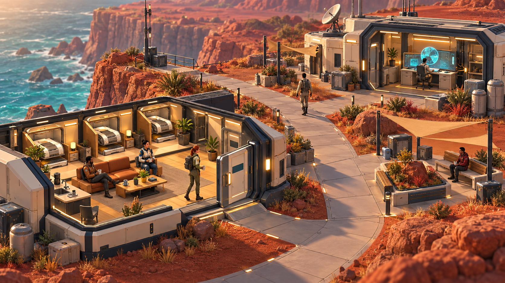

# Starbase2: a world worth spending time in

Status: proposed

Research date: 2026-09-10. Research and proposed production direction.
Owner: implementation assistant; Al owns final visual and play-feel acceptance.
No gameplay, installed skill, model provider, deployment or memory policy was
changed by this research. One original concept was generated and reviewed.

## Recommendation

Build **Shift Change**: a small, beautiful, continuously inhabited neighborhood
connecting Habitat, Commons and Command. Make its characters comfortable at home,
purposeful in motion, and legible at work. Give the operator an enjoyable place to
watch and a direct way to inspect what actually happened. Extend its successful
visual and interaction language to Engineering, Botanical and the rest afterward.

This concept explores composition and atmosphere. The seated figures, lighting,
open architecture and revised layout are not implemented assets. The illustration
does not define new operational crew identities. The saved
[prompt and provenance](../assets-production/batches/shift-change/concepts/art-target-v1.md)
identify the actual Godot screenshot references and built-in generation tool.

## What the examples actually establish

**Dream Loop provides a useful production method.** Its README describes generated
visual targets, construction, independent screenshot criticism and refinement.
The inspected revision is
[`9bddb901f7d071cfefdd21e264267c757177a9df`](https://github.com/achimala/dream-loop/commit/9bddb901f7d071cfefdd21e264267c757177a9df).
Its Pro workflow compares target/current/previous images and critic feedback,
with explicit handling of stalled improvement. Its asset workflow extracts
individual object references from a coherent scene. Those mechanisms fit our
pipeline. Its Plus workflow discourages Blender, and its paid helper targets Fal;
neither is the workflow we want to copy. Read as reference, not installed or run.
[Repository](https://github.com/achimala/dream-loop),
[Pro workflow](https://github.com/achimala/dream-loop/blob/9bddb901f7d071cfefdd21e264267c757177a9df/references/pro-mode/workflow.md),
[asset workflow](https://github.com/achimala/dream-loop/blob/9bddb901f7d071cfefdd21e264267c757177a9df/references/pro-mode/assets-3d.md).

**The original creator explains the progression behind the demo.** Anshu's X
thread describes image references, Blender MCP and iteration against game
screenshots. A follow-up identifies the initial result as a small graphics demo;
later posts describe additional hours on gameplay, weather and birds. Elapsed
time and quota figures are self-reported, not reproducible cost estimates for us.
[Original thread](https://x.com/anshuc/status/2096008083826725132).

**Paperboy is unusually relevant to our tool combination.** Its creator says
the appearance, models and rendering took substantial iteration. A follow-up
describes switching character production to generated images, Meshy, then Astra
for rigging and animation. We should use different tools where they work best.
[Original and edit history](https://x.com/builtbysketch/status/2096515959469072630/history),
[character workflow follow-up](https://x.com/builtbysketch/status/2096946592683098345).

**Wes Roth describes the complete creative pipeline.** His sequence covers image
references, Blender geometry and animation, engine integration, sound and
playtesting. Treat his reported twelve-hour result as one creator's account;
the transferable lesson is carrying a visual idea through the whole experience.
[Original post](https://x.com/WesRoth/status/2096362079217479799).

**Additional X research supports separating asset work from integration.** Chong-U
describes a reference-image-driven Blender/Unity experiment. In the replies he
specifies programmatic Blender MCP, separate modeling and integration passes,
and specialized generation tools for characters. This is a firsthand workflow
account, not a benchmark of finished-game quality.
[Post and replies](https://x.com/chongdashu/status/2096628135630615028).

**Hank's demonstration is a separate category.** The supplied post claims adapting
Wind Waker for a phone; follow-ups discuss browser and VR adaptations. That
illustrates ambitious engine/platform work, but does not establish an original
character-and-environment production method for Starbase2.
[Original post](https://x.com/h4nkdog/status/2097087133534036374).

**The official game-building account adds engineering substance.** Thomas
Ricouard describes visual references, editable Blender assets, procedural
environments and a small inspection interface. Named starting scenes complement
real-control journeys. Renderer counters and controlled comparisons help diagnose
problems, with explicit limits on performance claims. For Starbase2, transfer the
feedback loop while retaining Godot.
[Building games with Astra](https://developers.openai.com/blog/how-to-build-games-with-astra).

**The Kingy guide is supporting material.** It illustrates staged Blender work,
reopening saved files and checking exports, and distinguishes inspected examples
from inaccessible social media. Its linked primary sources are stronger evidence
for creator results than the guide's own summaries.
[Guide](https://kingy.ai/blog/blender-openai-astra-complete-guide/).

**A Godot example provides a useful reality check.** NULLSPACE retains authored
Blender sources, generators, runtime exports and explicit native QA limitations.
It supports the feasibility of this engine/asset pipeline while acknowledging
that development and polish are ongoing.
[Creator repository](https://github.com/marius4lui/NULLSPACE).

Access note: web retrieval returned 403 for the supplied X posts. The browser
subsequently exposed the original posts, Paperboy edit history, creator replies,
and additional X search results. The supplied trending page was inspected as a
discovery page; its generated summary is not independent evidence. Sampled a
Paperboy video frame, but did not watch every embedded video or execute these
external games/repositories. No popularity counts or one-shot claims establish
our likely production time, cost or quality.

## Where Starbase2 can improve most

The current native build already has the essential technical foundation: real
autonomous duties, evidence, Godot controls, physical crew routes, seamless
interiors, cutaways, rigged characters and retained asset sources. The current
Habitat has a galley, lounge, dining furniture and sleep capsules. Its existence
is not the missing feature; its use by the crew is.

The inspected colony screenshot is an overview, so distant figures there are
expected. Add a closer inhabited view for passive watching while preserving that
useful overview. Close-up captures show overlapping evidence labels and large
panels obscuring the people whose work they describe. Habitat's broad empty
center and partially hidden sofa weaken its social focus.

| Priority | Visible change | Production approach |
| --- | --- | --- |
| 1 | Crew sit, drink, stretch, converse and rest; real assignments interrupt gracefully | Authored activity anchors and occupancy; Blender sit/stand/reach/turn clips; Godot intent and physical navigation |
| 2 | Recognizable people with readable faces, suit silhouettes and grounded movement | Inspect existing rigs/materials at gameplay distance; image references and Meshy only where replacements add value; Blender contact and deformation work |
| 3 | Habitat feels warm and occupied, Command focused, Engineering industrial | Cohesive material families, purposeful light placement, room composition and selective props |
| 4 | Operator follows a person and inspects a result without losing the scene | Opt-in crew camera, restrained attention markers, compact contextual inspector and native keyboard equivalents |
| 5 | Paths feel like places connecting destinations | Door thresholds, planted edges, shaded seating, small landmarks and consistent scale |
| 6 | Motion and sound respond to actual movement | Shared wind direction for foliage/hair/cloth where supported; foot contacts, door sounds, local room ambience and water response |

Existing code foundations include `apps/world/crew_motion.gd`,
`crew_presentation.gd`, `characters/model_visual.gd`, `living_commons.gd`,
`structures/interiors/habitat-continuous.tscn`, `world.gd` and `command_board.gd`.
The [living-autonomy plan](living-autonomy.md) specifies authoritative transitions.

## A production loop adapted to our game

1. **Lock one playable experience and its references.** Start with the occupied
   lounge, doorway and adjacent path. Keep a normal gameplay camera, an interior
   close-up and a compact inspector view. Use this concept for direction, then
   make camera-matched targets before detailed production.
2. **Split concrete work across agents.** One owns character contacts/animation;
   another owns architecture/materials/environment. A single integrator owns
   shared Godot scenes. A separate critic sees target, actual native captures,
   previous iteration and the declared experience, and identifies the three
   largest remaining visible gaps.
3. **Use tools deliberately.** Image generation establishes silhouettes, palette,
   material references and isolated asset views. Meshy supplies selected organic
   or distinctive detailed assets. Blender supplies editable architecture,
   dimensional correction, rigs, contact poses, UV/material preparation and
   efficient exports. Godot supplies all actual behavior, effects, sound,
   camera movement and operator interaction.
4. **Rehearse quickly.** A small Habitat scene should instantiate the real runtime
   character, furniture and routes. Record a short motion sequence after each
   meaningful change. Fix the visible problem before rebuilding every district.
5. **Critique actual gameplay.** Compare matching camera captures plus motion,
   contact, readability and frame-time evidence. A beautiful still cannot pass
   a broken doorway or sliding seated character. Critic scores guide art changes;
   they do not certify operational correctness or owner approval.
6. **Bound each experiment.** Start with three purposeful revisions. If the same
   gap persists, change the geometry, animation approach or composition. Check
   the existing Meshy ledger before allocation; the earlier 1000-credit budget
   is not a fresh allowance. This research spent no Meshy credits.

Keep the current renderer for the first comparison: `project.godot` selects
Compatibility. The concept's soft indirect light and blur are aspirations, not
proof of attainable runtime quality. Test a small optional rendering experiment
only if the chosen look actually needs it, using measured native performance on
the target machine. No engine migration follows merely from a browser demo.

## First complete slice: Shift Change

The operator opens a closer view of Habitat. One crew member sits with a cup;
another is at the galley. A third walks through the sheltered Commons. A scheduled
Watchkeeper observation begins independently in Core. Its character stands,
turns, leaves through the door and walks toward Command. Where the task remains
active on arrival, the actor settles into its work pose.

When evidence arrives, a small report indicator appears immediately. Selecting
the person, the station or native keyboard inspection opens the same retained
record. A later tablet placement or report-delivery gesture is decorative and
never delays access. If work finishes during travel, the character turns home;
the game does not invent a work session. The rest of the crew continues domestic
activity. Pausing future duties does not cancel a task already running.

Completion requires:

- An uninterrupted native sequence that makes relaxation, assignment, travel and
  report availability understandable; a deterministic rehearsal exercises all
  motions, while a real run separately proves backend integration.
- Correct seat/hand/foot contact and door clearance, including interruption while
  sitting, short jobs, concurrent assignments and a blocked route.
- Calm stale/offline presentation and reconciliation to current records after
  reconnect, without replaying obsolete trips or presenting old work as live.
- Readable compact and keyboard interaction, reduced motion and sound-off use.
- Before/after captures and measured native frame times at the same settings;
  then fresh export qualification of the selected integrated result.

## Creative bets after the first slice

**A morning briefing you can enter.** Crew gather around Command's table; selecting
a report reveals its evidence. An optional chronological replay can summarize
work completed while the client was closed, explicitly labeled as history.

**A place that reflects its inhabitants.** Give each crew member a bunk, preferred
idle spot, silhouette and a few authored habits. Approved persistent memory may
later inform grounded recall, but cosmetic routines need no LLM call or memory
service. Memory remains a separate follow-up and is currently disabled.

**A tactile coast.** Make an overlook worth visiting: gusts, grass, cloth, water,
footsteps and room ambience agree with what the player sees. Prototype one shared
environmental effect before spreading unrelated particles over the map.

**Buildings that communicate at a glance.** A subtle active-work light, a report
marker and an explicit stale indicator can expose operational state through the
world. Expanded explanations remain one deliberate inspection away in Godot.
Ambient life can be rich without inventing incidents, health measurements or
agent decisions.

The immediate implementation order is contacts and idle life, the lounge-to-path
art pass, task interruption and compact inspection, then the complete native
journey. Broader plateau rebuilding and additional structures follow the quality
established by this small inhabited slice.
