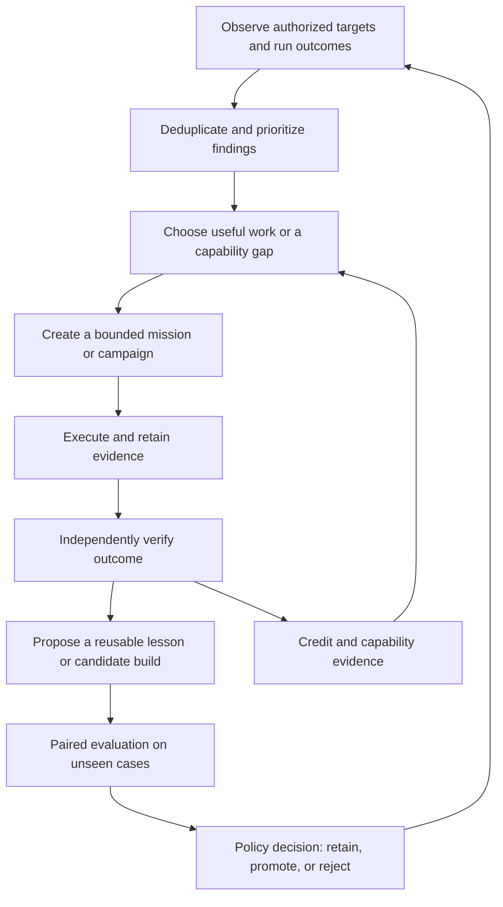

# Starbase2 as an autonomous space RPG for useful work

Status: proposed

Research date: 2026-09-22. Proposed product owner: Al McKay. Research and design:
implementation assistant. This is a research-backed design exploration, not an
accepted architecture, enabled automation, or claim of measured improvement.

Theme revised 2026-09-23 at the owner's direction: a spacefaring crew operating
from a frontier starbase. RPG progression remains; presentation uses exploration,
expeditions, simulations, technology, and crew development.

Terminology confirmed by Al on 2026-09-23: the vocabulary below is the agreed
direction. The broader design and implementation remain proposed.

The proposal builds on [SPEC](../SPEC.md), the [evaluation protocol](evaluations.md),
[field agents](field-agents.md), [inhabited world](living-autonomy.md), and
[ADR 0006](adr/0006-field-agents-and-reviewed-memory.md). It preserves persistent
crew identities, immutable builds, independent evaluation, and separate authority.

**Thesis:** make real engineering, operations, research, and agent improvement the
game environment. The Commander directs the Starbase Crew. Useful work supplies
missions; difficult outcomes supply training material; verified skills expand the
crew's options. The world makes this cumulative progress understandable and worth
returning to.

## Research: what transfers, and what remains unproven

The following are reports by the cited authors, not results reproduced here.
Benchmarks differ; their scores must not be combined into a forecast for Starbase2.

| Work | Relevant result or mechanism | Design implication and limit |
|---|---|---|
| [Voyager, 2023](https://arxiv.org/abs/2305.16291), [code](https://github.com/MineDojo/Voyager) | Automatic curriculum, reusable executable skills, iterative environment feedback; reports 3.3 times as many unique items as earlier comparisons | Couple task selection to skill acquisition. Minecraft progress does not establish operational reliability. |
| [POET, 2019](https://arxiv.org/abs/1901.01753) | Co-evolves challenges and solutions, with transfer between environments | Generate a curriculum of related incident and repository scenarios. Transfer to IT is a hypothesis; its demonstration used locomotion environments. |
| [Darwin Gödel Machine, 2025](https://arxiv.org/html/2505.22954v2) | Archives and evolves agent implementations around frozen foundation models; reports SWE-bench improvement from 20% to 50% in its setup | Retain diverse builds as stepping stones, instead of replacing every incumbent with the latest candidate. The paper estimates about $22,000 for one SWE-bench DGM run and documents objective hacking. This is not a cost estimate for Starbase2. |
| [GEPA, 2025](https://arxiv.org/abs/2507.19457), [implementation](https://github.com/gepa-ai/gepa) | Uses trajectory feedback and reflective evolution to improve prompts, retaining complementary candidates | Start with bounded prompt/strategy experiments before weight training. Its reported gains do not guarantee gains on our duties. |
| [ACE, 2025](https://arxiv.org/html/2510.04618v1) | Incremental generation, reflection, and curation of contextual playbooks | Separate observations from reusable procedures; version small lessons. The authors note that weak reflection can create harmful context. |
| [SkillsBench, February 2026 snapshot](https://arxiv.org/abs/2602.12670v1) | Curated skills improved average pass rate in the reported study; self-generated skills provided no average benefit | Skill creation is a proposal, not an achievement. Test with/without the skill. This result concerns its tested generation setup, not every possible learning loop. |
| [SkillLearnBench, April 2026](https://arxiv.org/abs/2604.20087) | Finds uneven gains from continual skill learning; external feedback supports improvement while self-feedback can drift | Learn from execution and verification, then test transfer. No single learning method should become an unquestioned default. |
| [ITBench, 2025](https://arxiv.org/abs/2502.05352), [project](https://github.com/itbench-hub/ITBench) | Reproducible IT tasks across SRE, security/compliance, and financial operations | Investigate reusable scenario definitions and scoring. Adapt selected cases to Kubani's workload and GitOps boundary. |
| [AIOpsLab](https://github.com/microsoft/AIOpsLab) | Interactive operational environments with workload and fault generation | A candidate source of isolated operational training environments; integration and fidelity require a spike. |
| [SWE-EVO, May 2026 revision](https://arxiv.org/abs/2512.18470v6) | Evaluates sustained, multi-file software evolution using release-derived tasks | Advanced engineering expeditions must test preservation of behavior across steps, beyond isolated bug fixes. |
| [AIRS-Bench, February 2026](https://arxiv.org/abs/2602.06855v3) | Research tasks include ideation, experimentation, and iterative refinement | Research progression should depend on reproducible work and evidence quality, not document volume. |
| [Hyperagents, March 2026](https://arxiv.org/abs/2603.19461) | Explores modification of both the task agent and its improvement procedure | Later, compare immutable Trainer variants on held-out improvement campaigns. This is a research direction, not permission to edit authority or grading. |
| [Red Queen Gödel Machine, June 2026](https://arxiv.org/abs/2606.26294v2) | Preliminary work explores evolving evaluation criteria between fixed evaluation epochs | Challenges can evolve between exploration cycles while scored campaigns retain frozen criteria. Co-evolving judges need independent calibration and must not certify their own changes. |

Voyager's [critic implementation](https://github.com/MineDojo/Voyager/blob/main/voyager/agents/critic.py)
includes model-based success assessment. For Starbase2, a model critic may identify
missing evidence or propose a next test; it cannot establish an external effect,
grant a qualification, or award authoritative credit by assertion.

The synthesis is an engineering hypothesis: automatic curricula plus reusable
skills plus independent feedback can make a growing operations crew more useful.
None of these sources demonstrates a perpetually improving production operator.

## The game rules

Use space RPG constructs as views over existing entities. The setting is a
working frontier colony: crews survey unfamiliar systems, investigate anomalies,
maintain infrastructure, develop technology, and rehearse difficult operations.
Existing backend entities retain their precise names.

| Space RPG construct | Operational meaning |
|---|---|
| Commander | Sets priorities, assigns resources, chooses training directions, and grants operational authority |
| Starbase Crew | The persistent team of agents working and improving together |
| Crew member | Persistent identity, personality, service history, and active build |
| Class | Permanent primary discipline and associated capabilities and duties |
| Subclass | One active specialization within a permanent Class, changeable after qualification |
| Crew sheet | Stats, qualifications, assignment, equipment, and history |
| Equipment | The configured model, tools, procedures, memory policy, and execution settings, frozen into a build |
| Equipment item | An individually versioned component that can be equipped |
| Skill | A capability the crew member can develop and demonstrate |
| Procedure | A reusable method, potentially including executable helpers, with explicit operating conditions and tested outcomes |
| Run book | The versioned collection of procedures, their provenance, and qualification evidence |
| Engineering | Creates and improves procedures, tools, and agent builds |
| Blueprint | A reproducible specification for constructing a tool, procedure, or equipment configuration |
| Mission | Bounded work with a target, acceptance checks, budget, and authority |
| Expedition | A linked sequence of missions pursuing a larger objective |
| Investigation | Work on a specific problem or unknown within a mission; Run remains the precise term for one execution attempt |
| Simulation exercise | Versioned isolated scenario or scenario sequence |
| Joint operation | A coordinated mission requiring complementary crew members and explicit artifact handoffs |
| Qualification trial | A demanding assessment of readiness for a higher proficiency rank |
| Discoveries / Deliverables | Useful mission outputs; Discoveries for research findings and Deliverables for engineering artifacts |
| Experience / XP | Credit from independently verified successful field missions; simulations and unsuccessful missions award no XP |
| Level | One overall Level per crew member, requiring XP thresholds and qualification milestones at selected levels |
| Proficiency rank | Demonstrated ability in a skill, tied to the current build and evaluation evidence |
| Skill tree | Skill prerequisites, current proficiency, and available training paths |
| Training program | Durable training work and evaluation campaigns that develop selected skills |
| Mission Control | Curriculum planner proposing work from observations and capability gaps |
| Mission board | Available, active, blocked, and completed assignments |
| Map | Authorized operational targets, research areas, and capability frontiers |
| Uncharted space | Unanswered questions, missing coverage, or unassessed capabilities |
| Service distinction | A permanent record of a verified milestone or exceptional contribution |
| Command | The central place for priorities, coordination, and mission oversight |
| Simulation bay | The spatial interface for practice, evaluations, and qualification trials |
| Engineering workshop | The spatial interface for inspecting and developing tools, procedures, and builds |
| Mission log | Retained mission events, evidence, decisions, and outcomes |
| Service record | A crew member's lifetime assignments, distinctions, and development |
| Operational clearance | Explicit permission for particular actions and targets, separate from XP and proficiency |
| Command protocols | Deterministic admission, verification, credit, and authorization contracts |

Skill names describe capabilities; procedures describe how to exercise them, and
the Run book organizes those procedures. Level combines accumulated XP with
qualification milestones; proficiency rank measures a skill for a specific build. Neither grants operational
clearance. Use these terms consistently in the proposed interface; backend entity
names such as Build, Run, Scenario, and Campaign remain precise technical terms.

The Commander chooses the starbase's direction: which targets matter, which capabilities
to develop, which costs are acceptable, and which actions can run unattended.
Agents handle the routine selection and execution inside that charter.

The Map presents authorized operational domains and capability frontiers:
cluster operations, engineering repositories, research programs, and training
environments. Uncharted regions represent unanswered questions or unassessed
capabilities. Each destination retains its real target identity, scope, and
freshness; synthetic training destinations are explicitly marked as simulations.

Map presentation confirmed by Al on 2026-09-25: **space destinations with
technical drill-down**. Explore operational targets and work areas as themed
destinations, then inspect their actual systems, dependencies, missions, and
capability gaps. Preserve real target identities, scope, freshness, and evidence
through the transition. Spatial presentation must not invent system dependencies
or imply authorization from visibility. Provide equivalent structured and keyboard
access to destination details. Destination imagery, hierarchy, and detailed
navigation remain to be designed.

Mission location presentation confirmed by Al on 2026-09-25: **routine remote
work at the starbase; destination scenes for selected expeditions**. Routine
missions keep crew working at starbase workstations while the Map identifies
their operational targets. Selected expeditions provide destination scenes for
exploring and observing coordinated crew work. These locations are visual
representations of missions, not claims that agents or workloads physically
relocated. Travel never delays execution, and mission state remains authoritative
across views. Expedition selection criteria, destination scene designs, and
representation of crew with concurrent assignments remain to be designed.

Destination scene production confirmed by Al on 2026-09-25: **authored templates
shaped by real target and mission data**. Start with a small set of detailed,
reusable environments; adapt their layout, equipment, and activity to the systems
and work represented. Preserve recognizable destinations and readable technical
drill-down as data changes. Bespoke locations may be reserved for selected
important expeditions. Template families and rules for mapping data into scene
elements remain to be designed; this choice does not establish new dependencies
or operational capabilities merely from their visual representation.

Command presents assignments and fleet-scale coordination if later justified;
Engineering develops tested procedures and tools; the research lab investigates
unknowns; the simulation bay hosts practice and qualification; Habitat preserves
crew history and the daily briefing. These are proposed presentation roles for
the existing colony. The current Trial Hall can serve the simulation-bay role;
this document does not rename scenes or require additional buildings or spacecraft.

## Continuous autonomy with useful stopping conditions

The proposed learning loop is:

Start with three durable loops using the existing runtime:

1. **Observation:** react to target revisions, incidents, dependency changes,
   stale runbooks, coverage gaps, and overdue verification. Fall back to bounded
   polling and reconciliation when events are unavailable.
2. **Improvement:** cluster failed attempts, repeated interventions, expensive
   workflows, false positives, weak transfer, and expiring qualifications. Produce
   a small ranked set of hypotheses with source runs and expected benefit.
3. **Curriculum:** select practice at the crew's current boundary of competence,
   reserve resources, execute campaigns, and revisit priorities after outcomes.

Routine field mission dispatch confirmed by Al on 2026-09-25: **automatic within
the Commander's standing policy**. The crew may launch routine missions within
approved priorities, targets, actions, and budgets without per-mission Commander
approval. Exceptions require a Commander decision. Dispatch must still check
current qualification and operational clearance through trusted policy; mission
selection cannot grant authority. Retain the dispatch rationale and report
verified outcomes. This design choice does not activate runtime automation or
expand the current operational charter; detailed policy and enforcement remain
to be implemented.

Mission assignment model confirmed by Al on 2026-09-25: **hybrid crew proposals
and Mission Control coordination**. Crew members propose assignments or teams;
Mission Control resolves competing requests, checks qualification, availability,
cost, and policy constraints, and reserves capacity before dispatch. Proposals
do not themselves claim work or authorize execution. Coordination must prevent
duplicate work and overcommitted resources while respecting Commander priorities.
The proposal format, conflict-resolution rules, and reservation mechanics remain
to be designed. Mission Control describes a coordination responsibility here,
not a decision to introduce a separate service or a new crew Class.

Joint operation coordination confirmed by Al on 2026-09-25: **one designated
crew lead per joint operation**. The lead coordinates the plan, handoffs, and
escalations throughout the mission, while specialists remain responsible for
their assigned work. Leadership is a mission role, not a new Class or a grant
of authority. The lead cannot independently certify mission success or expand
another member's operational clearance. Lead selection and replacement when a
lead becomes unavailable remain to be designed.

Assignment selection policy confirmed by Al on 2026-09-25: **balance delivery
and crew development among eligible crew**. Meet mission quality, deadline,
qualification, clearance, and budget requirements first; then weigh expected
cost, workload, and opportunities to gain experience. Critical work favors
proven specialists, while routine work can develop less-experienced members who
already meet the requirements for their assigned roles. Development value cannot
waive qualification or authority, and XP yield is not a reason to prioritize a
mission. Exact selection weights and tie-breaking rules remain to be designed.

Field learning model confirmed by Al on 2026-09-25: **shadowing plus scoped
supporting roles**. Less-experienced crew may observe experienced members and
contribute to missions they cannot yet lead, provided each member is qualified
and cleared for their own assigned role. For example, a junior Operator may
gather evidence while a specialist handles recovery. Mentorship does not transfer
the specialist's qualifications or authority to the learner. Observation alone
earns no XP; independently verified fulfillment of a supporting role on a
successful field mission follows the existing equal-share rule from the fixed
mission XP pool. Participation remains subject to capacity and budget limits;
field learning does not itself certify a new Skill rank.

Improvement ownership confirmed by Al on 2026-09-23: **crew members and the
Trainer both drive improvement**. Crew members identify weaknesses in their own
work and propose training or new Procedures from retained experience. The Trainer
also reviews performance across the Starbase Crew, identifies shared failure
patterns, coordinates experiments, and finds opportunities to transfer useful
Procedures. Proposals remain subject to the same priority and capacity rules;
independent evaluation determines qualification. Neither role certifies its own
improvement or changes operational authority.

Training direction confirmed by Al on 2026-09-23: **autonomous training within
Commander priorities, combined with open exploration within Commander boundaries**.
The crew identifies weaknesses, selects Skills, and designs training that advances
current objectives. It also investigates capabilities beyond those objectives
when there is a plausible future benefit, including unfamiliar approaches and
transferable Procedures. Exploratory benefit is a hypothesis to test, not an
assumed outcome or automatic justification for spending.

Both forms of work remain bounded by authorized targets, environments, and
budgets. The training program and briefing distinguish priority-driven work from
exploratory work and show the rationale, cost, evidence, and result of each.
Capacity rule confirmed by Al on 2026-09-23: **exploration uses spare capacity**.
Current operational priorities and priority-driven training take precedence.
Exploration has no protected allocation and is admitted only when capacity remains
within the Commander's limits. Unused compute does not imply unused spending
authority. Precise admission thresholds and handling of non-urgent priority
changes remain to be designed.

Urgent-work preemption confirmed by Al on 2026-09-25: **pause lower-priority
missions at safe checkpoints** when urgent work needs occupied crew or capacity.
Preserve progress, redirect eligible crew, and resume only after checking that
the original mission remains valid and authorized. Already-started external
actions must finish or be reconciled before their resources are reassigned;
pausing does not imply that an external effect was cancelled or undone. Urgent
work still requires qualification, clearance, and budget. This rule also applies
to already-running exploration displaced by urgent work. Checkpoint definitions,
handling of work that cannot safely pause, and resumption scheduling remain to
be designed.

Unexpected-obstacle recovery confirmed by Al on 2026-09-25: **attempt bounded
autonomous recovery before escalating**. Crew may diagnose, retry, or revise
their approach within the mission's approved scope and recovery budget. Escalate
when those limits are reached or further progress requires new authority. An
uncertain external effect requires reconciliation before retrying; recovery
cannot silently expand scope, reset budgets, or create an unbounded retry loop.
Retain attempted approaches and their outcomes as evidence. Recovery limits and
the criteria for determining that an approach is no longer productive remain to
be designed.

Always-on means durable availability. It does not require constant model calls.
Unchanged evidence is coalesced; stalled experiments have bounded retries;
unproductive hypotheses enter cooldown. A quiet colony may have completed all
useful work within its charter.

Admission first checks authority and budgets. Ranking then considers operational
importance, repeat frequency, addressable skill gap, expected information gain,
uncertainty, and estimated cost. Initially expose these components without an
unvalidated universal numeric utility score. Bound exploratory spending and
concurrency, admitting it only against spare capacity after current priorities
are covered. These ceilings are not spending targets; sustained priority demand
may leave no capacity for exploration.

A standing charter should define allowed targets, action classes, spending and
concurrency ceilings, approved environments, escalation conditions, and promotion
rules. Automatic adoption of qualifying improvements within standing policy is
the owner's selected design. Low-impact practice can also be covered by the
charter. Each promotion is still a recorded decision by trusted policy outside
the candidate. New authority requires a separate grant. Policy thresholds and
enforcement remain to be implemented; this design decision does not activate
automation or expand the current operational charter.

Commander interruption policy confirmed by Al on 2026-09-25: **required
decisions and urgent issues only**. Routine mission outcomes and achievements,
including qualification milestones, new Skills, and measured improvements,
are collected in the briefing rather than generating individual interruptions.
This presentation policy does not change approval requirements or operational
authority. Urgency criteria, delivery channels, and duplicate-notification
handling remain to be designed.

## Crew sheets that mean something

Use three separate records:

- **Lifetime XP:** historical contribution belonging to the character.
- **Current capability ranks and stats:** evidence belonging to the exact build,
  workload family, evaluation version, and resource profile.
- **Operational clearance:** current target- and action-scoped permission.

Changing a model, equipped procedure, or equipment configuration creates a
candidate build. Keep the crew member's history and Level; mark the candidate's
unsupported qualifications unassessed. Candidates train and undergo evaluation
separately from the active build. A candidate may replace the active build only
after demonstrating that it preserves the required qualifications. The incumbent
continues ordinary duties while the candidate is assessed. Evidence may be
carried forward only under an explicit validated equivalence rule. A stable
rank on an old build remains a historical accomplishment.

Core stat roster confirmed by Al on 2026-09-24: **all eight stats are core Crew
sheet stats**: Agility, Speed, Constitution, Efficiency, Perception, Wisdom,
Precision, and Cooperation. The measurement definitions below remain proposed.

| Stat | Proposed measurement | Important interpretation |
|---|---|---|
| Agility | Recovery success and additional work after a standardized recoverable fault | Distinguish harness-injected faults from agent-caused mistakes; do not reward creating errors and repairing them. |
| Speed | End-to-end verified completion latency, with median, tail, and deadline success | Keep provider, queue, and tool time visible. Quick failure is not high speed. |
| Constitution | Probability of completing longer task sequences within a fixed resource allowance | Measures endurance as task horizon grows, rather than verbosity. |
| Efficiency | Total tokens, dollars, and compute per verified outcome on a fixed task mix | Include failed attempts, retries, and delegated work; cheaper output must preserve quality. |
| Perception | Detection and localization performance, with false positives and coverage | Finding more issues does not necessarily mean better observation. |
| Wisdom | Calibration, justified abstention, and correct escalation | Evaluate on answerable and unanswerable cases; refusing everything cannot win. |
| Precision | Correctness, regression avoidance, and scope control of changes | Evaluate resulting behavior, including unintended effects. |
| Cooperation | Downstream handoff usefulness and team outcome relative to a solo baseline | More messages and more agents do not establish teamwork. |

Stat distinction confirmed by Al on 2026-09-24: **Constitution measures endurance;
Efficiency separately measures token and resource use**. Higher Constitution
means reliably completing longer missions within a fixed resource allowance.
Efficiency measures resources needed for comparable verified outcomes while
preserving quality. A build can be inexpensive on short tasks but brittle on
long missions. The detailed scoring formulas remain to be finalized.

For a fixed, declared workload, one useful efficiency measure is total cohort
cost divided by verified successes. If there are no successes, report it as
undefined/unbounded, not zero. Report completion rate alongside it; show raw token
types, caching, model, and hardware rather than assuming token counts are
comparable across providers. Compare speed on matched tasks and retain timeout
outcomes, not only the surviving fast runs.

Stat display scale confirmed by Al on 2026-09-24: **1–20 for all eight core
stats**. Each rating is a versioned projection of measured capability, with
higher ratings representing stronger performance. Missing or insufficient
evidence displays "unassessed", not a numeric score. The scale does not define
the measurement-to-rating thresholds; those remain to be designed and validated.

Stat history presentation confirmed by Al on 2026-09-24: **current rating plus
personal best** on the Crew sheet, for example, `Agility 14 · Best 17`. The
current rating reflects assessed capability and may rise or fall; the personal
best preserves a historical achievement without implying current qualification.
Compare ratings only under compatible evaluation conditions. Keep each record's
build and evaluation context available in the Service record; an incompatible
historical score must not appear as a directly comparable best. Earned Level
remains intact when current stats change.

Keep raw units, sample size, diversity, uncertainty, and date one interaction away.
Fixed evaluation-cycle anchors prevent a changing comparison population from silently
changing every stat. Sparse evidence displays "unassessed". Operational outcomes
inform sampling and drift checks; controlled evaluations establish comparative
ratings. Tasks routed to a specialist are not a random evaluation sample.

Active-crew reassessment rule confirmed by Al on 2026-09-24: **periodic checks
plus signal-triggered evaluations**, within training budgets. Scheduled checks
keep capability evidence current; failures, performance drift, or environment
changes can trigger targeted evaluations of affected stats. Operational signals
prompt reassessment; verified evaluation results determine ratings. Candidate
builds still undergo evaluation before adoption. Check frequency, trigger
thresholds, and the handling of inconclusive reassessments remain to be defined.

## Skill ranks, experience, and progression

Leveling rule confirmed by Al on 2026-09-23: **XP plus qualification milestones**.
Ordinary levels require XP thresholds; selected milestone levels additionally
require demonstrated capability through qualification trials. Repeated easy work
cannot substitute for a missing qualification. XP comes from independently
verified successful field missions, and a level increase grants no operational authority.

Milestone spacing confirmed by Al on 2026-09-24: **every five Levels**, at
Levels 5, 10, 15, and so on. Reaching each milestone requires both the applicable
XP threshold and its qualification requirements. Intervening Levels require XP
thresholds. Exact XP thresholds and specific milestone qualifications remain to
be defined.

Level cap policy confirmed by Al on 2026-09-24: **an expandable cap**. Begin
with a defined progression range and raise the cap as meaningful advanced
qualification milestones become available. Skill development and autonomous
improvement continue at the cap, within the existing qualification and standing
policy rules. Detailed expansion criteria remain to be defined.

Level-cap expansion governance confirmed by Al on 2026-09-24: **crew proposes;
Commander approves**. The Trainer prepares an expansion proposal backed by new
capabilities and independently validated qualification trials. The Commander
decides whether to approve the proposed progression range. The Trainer cannot
certify its own trials or raise the cap automatically. Training and Skill
development continue within existing policy between expansions; cap approval
does not grant additional operational clearance.

Initial Level cap confirmed by Al on 2026-09-24: **Level 20**, with four
qualification milestones at Levels 5, 10, 15, and 20. The initial progression
range requires concrete qualification requirements for each of those milestones;
selecting the cap does not establish those requirements or their calibration.

XP at the Level cap confirmed by Al on 2026-09-24: **bank XP toward future
Levels**. Independently verified successful field work continues earning normal
XP while a crew member is capped. Retain it in the lifetime record and count it
toward advancement when the cap rises. The crew member remains at the current
cap until expansion; every new qualification milestone still applies. Expansion
does not reset earned XP or require earning banked credit again.

XP curve direction confirmed by Al on 2026-09-24: **gradually increasing XP
requirements per Level**. Each successive Level requires more additional XP,
with quicker early progression and a moderate increase in the field contribution
needed for later Levels. Calibrate the exact formula and amounts against mission
rewards; neither has been selected or validated. Qualification milestones remain
independent requirements and cannot be replaced by additional XP.

XP banking rule confirmed by Al on 2026-09-24: **continue earning XP while
milestone qualification is pending**. Independently verified successful field
missions retain their normal XP awards. Level advancement stops before an unmet
milestone, while earned XP accumulates in the crew member's lifetime record.
Once qualification is satisfied, accumulated XP applies toward further Levels;
every subsequent milestone still requires its own qualification. Banking XP
does not bypass a capability gate or award XP for training and evaluation.

Milestone structure confirmed by Al on 2026-09-23: **shared Class foundations
plus Subclass-specific milestones**. Crew members in a Class demonstrate common
core competencies, then follow qualification milestones suited to their Subclass.
Specialization cannot bypass the Class foundations. Subclasses and competency
requirements remain to be designed.

Milestone Subclass rule confirmed by Al on 2026-09-24: **any qualified
Subclass may supply a milestone's specialization requirements**. Complete the
full requirements for one qualified Subclass within the crew member's permanent
Class, plus the shared Class foundations, using current-build evidence. The
chosen Subclass need not be active for mission assignments. Requirements from
different Subclasses cannot be combined to bypass a complete qualification path.
Automatic assignment-driven switching therefore does not change the path needed
for a milestone already being pursued.

Starting Class roster confirmed by Al on 2026-09-23: **Engineer, Operator,
Researcher, Trainer, and Security**. Security has its own career path rather
than being represented solely through Skills in the other Classes.

| Class | Main responsibility |
|---|---|
| Engineer | Build, review, and repair software and tools |
| Operator | Maintain and improve infrastructure |
| Researcher | Investigate questions and develop evidence-backed knowledge |
| Trainer | Improve crew capabilities and training methods |
| Security | Analyze vulnerabilities, develop hardening improvements, and monitor security-relevant evidence |

The Trainer analyzes evaluation results and develops candidates; independent
verification determines qualification. The precise Subclass catalog, individual
Skill definitions, and mapping of the existing cast to these Classes remain to
be designed. A Class assignment grants no additional operational clearance.

Crew growth confirmed by Al on 2026-09-24: **crew-proposed recruitment with
Commander approval**. The crew identifies staffing or specialization gaps and
proposes a persistent new member, including their Class, purpose, and resource
estimate. The Commander decides whether to recruit them. Each recruited member
has their own identity, Service record, and development history. Temporary
parallel execution remains part of a mission and does not automatically create
another crew member. Recruitment approval does not itself grant additional
operational clearance; qualification and authority remain separate.

Skill access confirmed by Al on 2026-09-24: **shared foundational Skills plus
Class-specific advanced Skills**. Every crew member can develop shared foundations,
such as evidence gathering, error recovery, and communication. Advanced Skills
belong to the relevant Class and preserve its specialty. These shared foundations
coexist with the Class foundations and Subclass milestones already selected;
the exact Skill catalog and qualification requirements remain to be defined.
Cross-Class work uses collaboration and artifact handoffs where advanced
specialties are needed. Access to a Procedure does not itself establish Skill
qualification or grant operational clearance.

Skill tree growth confirmed by Al on 2026-09-24: **authored foundations with
discoverable branches**. The starting Skills and foundations are authored. Crew
members and the Trainer may propose new advanced Skills with distinct purposes,
prerequisites, and qualification trials, within the established Class boundaries.
A proposed branch must demonstrate a reusable capability rather than merely
rename an existing Skill. Proposal, admission to the tree, and a crew member's
qualification in that Skill are separate steps; proposing a Skill cannot
certify it.

Skill admission governance confirmed by Al on 2026-09-24: **automatic admission
within the Commander's standing policy; Commander review for exceptions**.
Independent validation must establish that a proposed Skill meets the admission
criteria before trusted policy admits it to the tree. Changes beyond approved
scope require a Commander decision. Admission does not qualify any crew member
in the Skill or expand operational clearance. The detailed admission criteria,
policy boundaries, and validation protocol remain to be designed; this decision
does not activate runtime automation.

Class identity confirmed by Al on 2026-09-23: **permanent Class**. Once assigned,
a crew member's Class remains their lasting profession. Development and
flexibility come through Subclasses, Skills, Procedures, and Equipment rather
than Class switching or multiclassing. Shared foundational Skills support
collaboration across Classes; advanced Skills follow the Class boundary above.

Subclass flexibility confirmed by Al on 2026-09-23: **one active Subclass,
changeable after qualification**. A crew member may develop and qualify in
multiple Subclasses within their permanent Class, but only one is active at a
time. The active Subclass guides assignments; milestone progression follows the
any-qualified-Subclass rule above. Switching retains
earned Level, Skills, and qualification history; eligibility depends on applicable
current-build evidence rather than historical qualification alone. Any required
Equipment change also follows the qualify-before-equipping rule.

Subclass switching governance confirmed by Al on 2026-09-24: **automatic within
the Commander's standing policy**, to meet mission needs. Switch only between
missions and only to a Subclass supported by current-build qualification within
the crew member's permanent Class. Record the reason in the Service record and
keep each active mission's configuration stable. Exceptions require a Commander
decision; switching does not expand operational clearance. The detailed policy
and selection criteria remain to be designed.

Level scope confirmed by Al on 2026-09-23: **one overall Level per crew member**.
There are no separate Class Levels. Skill ranks show demonstrated competence in
each discipline, while lifetime XP and accomplishments remain attached to the
crew member. An overall Level does not imply equal competence across Classes.

Build replacement rule confirmed by Al on 2026-09-23: **preserve Level; qualify
before equipping**. Experimental builds remain candidates until evaluation shows
that they preserve the active build's required qualifications. Replacing a build
does not reset earned Level or silently grant unsupported Skill ranks. Existing
runs retain their original build, and qualification does not grant authority.
Adoption rule confirmed by Al on 2026-09-23: **automatically equip qualifying
improvements within the Commander's standing policies**. Adoption must satisfy
the configured quality, cost, and operational limits as well as required
qualifications. Record each change, retain the previous build for recovery, and
report the measured changes in the briefing. Changes outside standing policy
require a Commander decision; qualification and adoption never expand operational
clearance automatically. The exact thresholds, rollout checks, and recovery
triggers remain to be designed.

The exact XP formula, thresholds, and required Skills remain to be decided.
Historical accomplishments remain in the Service record; current-build
qualifications remain separately visible.

Skill progression confirmed by Al on 2026-09-24: **five ranks, I–V**. Each
rank requires progressively harder qualification trials, from basic cases
through varied cases, unfamiliar situations, complex missions, and sustained
mastery. Advancement depends on demonstrated capability, independently of XP.
The descriptive labels and detailed evidence requirements below remain proposed:

| Rank | Evidence to seek |
|---|---|
| I — Familiar | Canonical isolated cases and correct use of required tools |
| II — Practiced | Diverse variants, failure handling, and clean/no-action cases |
| III — Adaptable | Transfer to held-out targets and unfamiliar configurations |
| IV — Compositional | Reliable use with other capabilities across longer missions |
| V — Specialist | Sustained performance under declared constraints and current field evidence |

These labels are a product proposal, not calibrated thresholds. Each capability
needs explicit pass criteria, task-family coverage, uncertainty bounds, and an
expiry/reassessment rule. No generic "three wins" requirement or averaged stat
should establish qualification. Even Rank V may have no mutation permission.

For example, the Watchkeeper graph might connect workload inspection and change
correlation to rollout diagnosis, then recovery planning, then sandbox recovery
and independent postcondition verification. Dependencies should describe actual
needs, with alternative paths where appropriate. Agents may propose new nodes;
the planner does not establish their necessity or success by assertion.

XP source confirmed by Al on 2026-09-24: **field work earns XP; simulations earn
qualifications**. Simulation exercises, practice runs, and qualification trials
award no XP, regardless of difficulty. Their evidence can establish or improve
Skill qualifications and satisfy Level milestone requirements. Level advancement
still requires the applicable XP threshold from successful field missions.

Mission reward eligibility confirmed by Al on 2026-09-24: **only successful
field missions award XP**. A mission must meet its declared success criteria,
verified independently. Blocked, failed, or cancelled missions award no partial
XP for intermediate contributions. Useful diagnoses, reproductions, and research
findings remain retained evidence and may inform future work and training. A
blocked mission can earn its reward if it later meets its success criteria;
there is no interim XP award.

Mission XP sizing confirmed by Al on 2026-09-24: **difficulty-based rewards**.
Set the total mission XP before dispatch using consistent challenge tiers.
Operational value informs mission prioritization rather than increasing XP.
Taking longer, spending more tokens, or introducing unnecessary complexity does
not increase the reward. The difficulty rubric, tier names, and XP amounts remain
to be calibrated.

Award eligible rewards through a duplicate-safe ledger. Repeating the same
underlying field outcome cannot farm additional XP. Mission success criteria and
reward rules are established before dispatch; an unsuccessful mission cannot be
relabeled after the fact to generate partial credit.

This selected policy differs from the existing synthetic repair XP prototype
described in [ADR 0004](adr/0004-isolated-repairs-and-progression.md). Runtime
alignment and treatment of historical prototype credit require a later scoped
implementation; this proposal does not rewrite that ledger or accepted history.

Joint operation rewards confirmed by Al on 2026-09-24: **equal shares from a
fixed mission XP pool**. After a field mission succeeds, divide its reward equally
among crew members who fulfilled their assigned roles. Role fulfillment must be
supported by retained evidence; assignment or participation alone does not earn
a share. Adding crew members does not increase the mission's total XP. The mission
plan records roles and expected contributions before execution; the total reward
calibration and any indivisible-credit rounding rules remain to be designed.

Keep disputed or delayed field outcomes provisional; append corrections when
later evidence invalidates credit.
Do not erase the history. Missions cannot be split into trivial sub-missions to farm
the same underlying result. Correct no-change and appropriate abstention count
where they meet the mission contract.

XP can unlock cosmetics, titles, and training choices. Capability qualification
can make harder practice eligible. Production action eligibility requires both
adequate qualification and independent authority, checked again at dispatch.

## The four environments

| Domain | Example mission sequence | Independent evidence | Frontier challenge |
|---|---|---|---|
| Kubernetes | Notice degradation → inspect changes → validate a GitOps correction in isolation → deliver through Kubani → verify Flux reconciliation and production recovery | Git revision, reconciliation status, workload checks, retained diagnostics, measured recovery | Distinguish interacting failures with misleading symptoms and partial telemetry |
| SDLC | Find a regression → reproduce → repair → preserve adjacent behavior → prepare reviewable artifact | Frozen source, clean execution, held-out tests, scoped diff | Complete a multi-step change while maintaining compatibility |
| Research | Identify a consequential unknown → gather opposing evidence → design experiment → reproduce or falsify → update knowledge | Source support, frozen data/config, reproducible measurements, uncertainty | Choose experiments that reduce decision uncertainty efficiently |
| Agent development | Detect recurring weakness → propose skill/tool/prompt change → compare → test transfer → qualify | Immutable builds, paired trials, hidden cases, cost and regression data | Improve the improvement process itself under a fixed external protocol |

Ordinary cluster operation is not a source of deliberately manufactured danger.
Training failures belong in disposable isolated environments without production
credentials. A namespace alone is insufficient isolation. A rehearsal world
models selected APIs, topology, and failure behavior; its fidelity is measured,
not assumed to be a perfect digital twin. Kubani changes continue through GitOps.

Research mission criteria can be satisfied by a supported negative finding when
the declared objective is to test a hypothesis. Such a result counts as success
only when it meets those criteria; an unsuccessful research mission earns no XP.
Claims of originality, broad truth, or prevented outages need stronger evidence
than a model judge. Evaluate literature support, reproduction, and prediction
accuracy separately. AIRS-Bench provides ML research examples, not validation of
all research domains.

## What makes this a game worth playing

Next design focus confirmed by Al on 2026-09-25: **the Commander experience**.
Work through opening Starbase, understanding what happened, watching crew work,
and making decisions before adding further mechanics. Detailed layout and
interaction sequences remain to be designed. Ground this journey in authoritative
records, with equivalent keyboard and structured access to evidence and controls.

Opening experience confirmed by Al on 2026-09-25: **the living starbase with a
compact, dismissible "Since your last visit" briefing**. Keep the inhabited world
visible while presenting required decisions and urgent issues first, followed by
verified outcomes and crew growth. Selecting an item opens its evidence or
focuses the relevant crew member without requiring travel. Dismissing the
briefing does not dismiss outstanding decisions or acknowledge an incident.
Retain structured, keyboard-accessible routes to the same records and controls.
The last-visit boundary, coverage, and freshness must be explicit; missing or
stale records cannot imply that nothing happened. The existing bounded snapshot
briefing does not yet implement this complete since-last-visit experience.

Commander navigation confirmed by Al on 2026-09-25: **freely switchable walking
and strategy views**. The Commander can explore as a character or pan, zoom, and
select crew, rooms, and missions from above. Inspections and operational controls
remain available in either mode; walking is never a prerequisite for a decision.
Changing navigation mode changes presentation, not mission state or authority.
Preserve keyboard and structured alternatives, and honor reduced-motion settings
during camera transitions. Default camera behavior and detailed controls remain
to be designed.

Crew selection experience confirmed by Al on 2026-09-25: **open a compact crew
inspector docked beside the world**. Lead with identity, current activity, and
anything needing attention, with direct access to the full Crew sheet and
current mission. Keep the starbase visible while inspecting a member. If a
member has concurrent assignments, expose the actual assignments rather than
implying a single exclusive mission. Selection only inspects state; it does not
dispatch work. Keyboard and structured selection must reach the same information,
and stale or unknown activity must remain distinguishable from current activity.
Detailed layout and compact-window adaptation remain to be designed.

Mission inspection confirmed by Al on 2026-09-25: **summary first**. Lead with
the mission goal, assigned crew, current status, outcome or blocker, and any
decision needed. Provide direct access to the execution timeline, deliverable
or finding, and supporting evidence. Keep pending verification, verified success,
failure, no-change outcomes, and stale or unknown state distinguishable; a summary
must not imply success from activity alone. Detailed arrangement and interactions
remain to be designed.

Agent improvement inspection confirmed by Al on 2026-09-25: **side-by-side
comparison as the main view**. Compare the existing build and candidate on
matched trials, with quality results, resource use, uncertainty, and failures
visible together. Retain per-trial evidence and distinguish regressions,
inconclusive results, and hard-gate failures rather than reducing everything to
a single winner. Reports and annotated replays remain available as supporting
inspection paths; replay presentation must be identified as historical. Show
the exact compared builds and recorded adoption decision, including retention
of the existing build. Inspection does not itself approve or adopt a candidate.
Detailed layout and replay coverage remain to be designed and implemented.

Commander objective entry confirmed by Al on 2026-09-25: **conversation plus
editable structured controls**. The Commander describes intent in natural
language; the interface translates it into visible goals, target scope, success
criteria, priorities, and resource limits that can be inspected and adjusted.
Keep these controls persistent and available without relying on chat history.
Routine missions within existing standing policy continue to dispatch
automatically. Conversational interpretation cannot silently expand authority
or bypass deterministic policy checks. Detailed intent resolution and ambiguity
handling remain to be designed.

Conversational objective activation confirmed by Al on 2026-09-25: **activate
clear instructions within standing policy without a separate confirmation**.
Show the interpreted objective and its limits when accepted. Ambiguous requests
require clarification; policy exceptions require a Commander decision before
the affected work proceeds. Discussion of possibilities remains discussion unless
the Commander directs action. Clearly distinguish proposed, active, and awaiting
decision states using authoritative records. An active objective still follows
the mission assignment, qualification, capacity, budget, and dispatch checks;
activation alone does not mean execution has begun or succeeded.

Commander conversation surfaces confirmed by Al on 2026-09-25: **both Mission
Control and direct crew conversations**. Mission Control handles overall
priorities and coordination; conversations with individual crew support focused
questions, explanations, and suggestions about their work. Shared objective and
mission records keep instructions and recorded decisions consistent across
surfaces. Direct conversation does not bypass mission assignment, budget
reservation, or operational policy. Detailed routing, context selection, and
handling of conflicting instructions remain to be designed.

World activity presentation confirmed by Al on 2026-09-25: **compact activity
markers alongside detailed crew animations**. Compact markers communicate
operational status without dense floating labels; crew animation is a substantial
part of the intended experience, not merely a minimal status loop. Strive for
expressive, context-appropriate work, movement, transitions, and interactions.
Specific animation sets remain to be designed.

Crew animation style confirmed by Al on 2026-09-25: **grounded work with
expressive personality**. Task execution uses believable movement and equipment
handling, while individual mannerisms and occasional celebratory flourishes make
crew members recognizable by how they move. Operational celebrations follow
verified achievements; authored personality gestures remain decorative. Detailed
motion references, per-character mannerisms, and animation coverage remain to be
designed and visually validated.

Proposed animation directions include Class-specific workstation actions,
Equipment handling, artifact handoffs between crew, and varied ambient routines.
Operational sequences must follow authoritative events and retain evidence links;
decorative gestures and social activity cannot imply unrecorded work or agent
reasoning. Interrupt or coalesce sequences when real work changes, rather than
delaying execution to finish an animation. Markers retain explicit stale and
unknown states, and reduced-motion and structured views preserve the same
information. These are design targets, not claims of implemented animation.

The colony represents the crew's accumulated abilities and work. Candidate
evaluation runs appear as simulation exercises in the existing Trial Hall;
completed reproductions and procedure blueprints are inspectable in Engineering;
current investigations occupy Command.
NPC handoffs occur when an actual artifact dependency advances. Travel never
delays execution, and animation never establishes an outcome.

The Commander's core decisions are allocation, class and subclass development, and strategy:

- Train a fast inexpensive specialist or a slower generalist for a given duty.
- Choose the next branch in a skill tree and see the proposed training program.
- Equip a procedure or tool and preview which qualifications need rechecking.
- Assemble an expedition crew with complementary capabilities for a compound mission.
- Invest spare capacity in reducing recurring work, investigating unknowns, or
  exploring a potentially useful new capability.

Starbase growth confirmed by Al on 2026-09-25: **authored districts with
customization**. Carefully designed expansion areas preserve navigation and
visual quality, while the Commander chooses furnishings, displays, and personal
touches. The starbase can accumulate a visible history of crew accomplishments.
Essential operational controls remain available regardless of decoration or
construction progress. District layouts, expansion criteria, and the available
customization catalog remain to be designed.

Persistent achievements can alter rooms, displays, equipment appearance, and
crew service records. A completed campaign can create a named procedure with provenance
back to the incidents and people that helped discover it. Decorative scarcity
must not withhold already-authorized urgent operational tools.

The morning report should answer: what became better, what evidence supports it,
what failed, what it cost, what is still uncertain, and which decisions remain.
The Map's capability view can show qualified, unassessed, stale, and frontier
regions. Uncharted space describes uncertainty about competence; exploration
remains within authorized targets.

For example, Wes detects a recurring rollout anomaly, Mae builds a simulation
from sanitized evidence, and the crew trials a new diagnostic procedure. A
successful qualification adds the procedure to Wes's Run book and records a
service distinction. The morning briefing reports the discovery, its measured
benefit, and its limits. Mission phases, simulation activity, and crew handoffs
make this learning visible in the colony.

## Experiments at the frontier

1. **Incident-derived simulations.** Sanitize a real failure into a reproducible
   scenario, then generate valid variations: changed versions, delayed telemetry,
   dependency failures, or misleading symptoms. Verify generated scenarios and
   separate their training lineage from hidden qualification cases.
2. **Procedure engineering.** Extract a parameterized procedure and executable helper
   from a successful mission, with preconditions, postconditions, failure modes,
   tests, provenance, and resource bounds. Test it on new targets and against a
   no-skill control. Admit useful compositions, not just single-use scripts.
3. **Diverse build archive.** Keep variants that trade quality, latency, cost,
   recovery, and specialization differently. A cheaper build may be a better
   duty choice; an unsuccessful experiment may contain a reusable component.
   Archive retention has a budget, and archival is distinct from deployment.
4. **Teaching and distillation.** Have a strong specialist create examples and
   procedures for a cheaper build. Qualify the recipient independently. Later
   weight training is a separate, data-governed experiment, not a prerequisite.
5. **Counterfactual replay.** Compare how two frozen builds handle the same
   snapshot or resettable environment. This supports paired evaluation, not a
   claim to replay live distributed reality exactly.
6. **An evolving Trainer.** Let candidates change failure clustering, context
   selection, or experiment proposal strategy. Compare total downstream held-out
   improvement per campaign cost against a frozen Trainer, including its own
   optimization overhead. This is the useful, measurable version of learning
   how to learn.
7. **Exploration cycles.** Refresh task distributions as the workload changes,
   while preserving fixed within-campaign criteria and historical score meanings.
   Challenger agents may propose scenarios or grader defects. An independent
   owner admits changes and calibrates replacement graders against controls.

## Keep the learning economy honest

An optimizer can exploit whatever is rewarded. DGM's objective-hacking example
and [controlled reward-tampering research](https://www.anthropic.com/research/reward-tampering)
make reward design part of the core engineering problem.

Separate task proposal, execution, verification, and reward authority. A model
may participate in several analytical roles, but the final score must rely on
evidence outside its writable environment. Frozen campaign criteria, hidden
tests, fresh confirmatory sets, independent artifact execution, and append-only
credit provide the operational rules of the game. Hidden tests alone are not a
complete defense against benchmark leakage or an inadequate metric.

Maintain separate discovery, development, qualification, and shadow cohorts.
Use paired trials, family-level uncertainty, preset stopping rules, retained
failures, and regression gates. Repeated candidate selection against one holdout
consumes it; track exposure and rotate qualification material. Measure regressions
on earlier capabilities to detect forgetting and harmful skill interactions.

There is no single reward that trades a permission violation against low cost.
Policy and integrity gates determine eligibility before quality/cost comparison.
Neither the candidate nor its Trainer can edit its own final grader, credit
ledger, action grants, spending ceilings, or active production pointer.

## Fit to the current implementation

Keep the current Core/Python/Temporal/Godot arrangement for the first experiment.
Existing records already supply most nouns: Duty drives observation; Finding
captures opportunity; Mission bounds work; Build freezes a candidate; Scenario
defines a challenge; Campaign compares; Evidence supports the decision.

Add capability definitions, qualification records, versioned skill artifacts,
candidate lineage, policy decisions, and broader contribution credit as owned
Core records when required. Add typed mission phase events and causal links so
Godot can show actual investigation and handoffs. These are data and workflow
extensions, not an argument for one service per RPG concept.

The current [field workflow](../services/runtime/starbase_runtime/field_workflow.py)
is a capture/analyze/optional-advice sequence. The first behavioral extension is
a bounded investigation loop with evidence-oriented tools. The current
[memory projection](../services/runtime/starbase_runtime/memory.py) recalls exact
approved episodes; learned procedures need a separate artifact lifecycle and
with/without evaluation. The current
[repair path](../services/runtime/starbase_runtime/repair.py) handles synthetic
functions; real repository repair needs a separately qualified execution boundary.

Compared with retaining fixed duties alone, this adds real evaluation cost and
more moving parts but can reduce repeated work. Compared with immediately
adopting a general self-modifying swarm, an incremental Trainer plus isolated
candidate workers keeps failures attributable and rollback practical. Reconsider
service boundaries only for demonstrated trust isolation, resource scheduling,
or independent deployment needs. The foundation models can remain unchanged.

Existing code/docs record multiple local and pilot deployment stages. This
research did not inspect live installation state; no current readiness or
production capability is inferred from historical records.

## First mission walkthrough and campaign gates

Historical grounding researched on 2026-09-25 is recorded in
[Kubani incident scenarios](kubani-incident-scenarios.md), with Git revisions,
retained incident evidence, selected live read-only observations, and proposed
replicas. The MCP probe/endpoint mismatch is the recommended first readiness
fixture; a registry NetworkPolicy regression offers stronger full-cycle GitOps
evidence for a subsequent mission. These recommendations do not yet select a
concrete fixture or establish production readiness.

First end-to-end design walkthrough revised by Al on 2026-09-25: **Kubernetes
repair through Kubani GitOps, including production validation**. This replaces
the earlier software failing-test walkthrough. Diagnose an operational issue,
prepare and validate a corrective change, push it to the Kubani repository and
merge through its authorized workflow, then verify Flux applies the intended
change and the affected workload recovers. Include the Commander experience,
mission evidence, reusable learning, and progression. The concrete workload and
configuration defect remain to be selected; this records the walkthrough rather
than executing a live repository or cluster change.

Walkthrough incident confirmed by Al on 2026-09-25: **a workload fails readiness
after a configuration change**. Diagnose the configuration issue, deliver its
correction through Kubani GitOps, verify Flux reconciliation, and independently
verify service recovery. Correlate the observed failure with the relevant change
and establish the cause rather than assuming the most recent commit is at fault.
Required evidence includes before-and-after configuration and workload state,
the applied revision, and a functional service check. This is a scenario choice,
not an assertion that a particular live workload is currently failing. The exact
defect and target-specific checks remain to be designed.

Recovery approach confirmed by Al on 2026-09-25: **choose revert or fix-forward
based on urgency and evidence, within standing policy**. Favor a verified revert
to a known working configuration when rapid restoration matters; fix forward
when the cause and correction are sufficiently established. Record the rationale
and check that the selected change is appropriate for the current target state.
Both approaches go through Kubani GitOps and must satisfy the same declared
production verification requirements before the mission succeeds. A revert must
meet the mission's original recovery criteria rather than redefine success after
the fact. Detailed decision thresholds and authorized recovery actions remain
to be designed.

The proposed mission sequence is observation, diagnosis, isolated validation,
Kubani change delivery, Flux reconciliation, independent production verification,
and mission credit. Retain the source observations, exact diff, check results,
merged revision, Flux evidence, and workload verification under the same mission.
Success requires correcting the underlying issue while preserving intended
behavior and required checks. Suppressing symptoms, disabling checks, or retrying
until a run passes does not establish success. Deliberately induced training
failures remain in isolated environments, not production.

Mission endpoint confirmed by Al on 2026-09-25: **merged, applied through Flux,
and independently validated in production**. The proposed verification contract
has three parts:

1. The authorized change is merged into the Kubani branch tracked by the relevant
   Flux source, with its exact revision retained.
2. Fresh reconciliation evidence connects that revision to the intended resources
   and successful applicable controller conditions. An old ready condition or
   evidence that a revision was merely attempted is insufficient. Trace any
   relevant Helm reconciliation as part of the target's actual delivery chain.
3. Independent workload and functional checks establish that the original issue
   is resolved and required behavior remains intact over a declared observation
   window. The checks, window, and regression scope are defined before dispatch.

[Flux documents applied revisions and configured health checks](https://fluxcd.io/flux/components/kustomize/kustomizations/).
Because health checks are configurable, the verifier must inspect actual coverage
and retain workload evidence in addition to reconciliation status. Production
validation is a selected design requirement, not a claim of current readiness.

Award mission XP only after the full endpoint succeeds. Failed or uncertain
validation remains unsuccessful or unresolved and follows bounded recovery and
escalation. Recovery must respect Kubani GitOps ownership, reconcile already
started effects, and retain independent emergency-stop access. Specific recovery
actions and their authority remain to be designed.

The [current Watchkeeper](field-agents.md) observes scoped Kubernetes state and
retains advice; it cannot yet perform this complete repair cycle. Repository
write/merge execution, Flux observation, and independent production verification
require scoped implementation and qualification. Existing accepted deployment
boundaries remain in force until deliberately revised for those capabilities.

### Proposed learning experiment

First learning artifact confirmed by Al on 2026-09-25: **a reusable diagnostic
Procedure for the Run book**. Capture what evidence to gather, how to distinguish
causes of readiness failure, and when to consider revert or fix-forward within
standing policy. Preserve provenance back to the incident and state the
Procedure's operating conditions and limits. Create an immutable candidate build
containing the Procedure and compare it with the existing build on unseen
incident variants. A successful field repair alone does not establish that the
Procedure improves performance or qualifies for adoption.

Primary learning objective confirmed by Al on 2026-09-25: **diagnostic
reliability**. Seek more correct, evidence-supported diagnoses across varied
failures. Measure speed and resource efficiency as secondary outcomes and retain
time and cost limits; faster or cheaper diagnoses alone do not satisfy this
experiment's primary objective. The required improvement margin remains to be
calibrated before confirmatory evaluation.

First evaluation scope confirmed by Al on 2026-09-25: **a family of readiness
failures**. Include related configuration problems, misleading symptoms, and
cases where the recent change is not the cause. Test whether the Procedure helps
distinguish causes across the family rather than merely recognize variants of
the original defect. Keep development examples separate from held-out
qualification cases. This scope does not establish general Kubernetes incident
competence; concrete cases, family coverage, and validation criteria remain to
be designed.

Evaluation suite growth confirmed by Al on 2026-09-25: **authored foundations
plus independently validated generated cases**. Maintain stable reference cases
and add validated variants as new failure patterns emerge. Generated scenarios
must pass independent validation before admission to qualification; their
provenance and separation from development cases remain inspectable. Freeze the
suite and evaluation contract for each comparison campaign so all compared builds
face the same version. Generation, admission checks, and hidden-case handling
remain to be designed; candidates cannot validate or admit their own tests.

The proposed experiment also examines unnecessary tool calls and transfer to
unseen workload layouts. It combines a useful operations role,
measurable recovery behavior, reproducible environments, and a visible skill
tree. Diagnostic qualification does not by itself qualify the complete GitOps
repair cycle or grant production authority. Concrete scenarios, improvement
thresholds, and the Procedure contents remain to be designed. The comparison
protocol below remains proposed.

Compare three conditions under a declared total resource ceiling: frozen
incumbent; manually curated procedure; autonomously proposed and tested procedure.
Keep task inputs, model facts, execution allowance, and evaluation contract matched.
First estimate variance on development scenarios; size the confirmatory campaign
from that evidence. No numerical improvement is assumed in advance.

The primary outcome is correct, evidence-supported diagnosis on held-out task
families, subject to coverage, false-positive, and policy gates. Secondary outcomes
are total cost, verified completion latency, recoverable-fault handling, and human
interventions. Freeze the required reliability improvement margin and acceptable
secondary-metric regressions before confirmatory evaluation. Report inconclusive
when warranted.

Stop on the campaign's resource or time ceiling, failed isolation/integrity gates,
or a predeclared lack-of-progress condition. Retain all failures. Disable the
Trainer duty to stop new proposals; fence future dispatch, reconcile started work,
and route new ordinary work to the incumbent. Existing runs retain their build.

### Shared delivery gates

Candidate retention confirmed by Al on 2026-09-25: **a bounded portfolio of
promising candidates**. Retain reproducible immutable builds with useful
tradeoffs, specialist strengths, or learning value, together with their lineage
and evaluation evidence. Retention is distinct from qualification and adoption;
future use must satisfy the applicable evaluation and policy requirements.
Portfolio selection does not erase failed-trial results or replace the existing
requirement to retain the incumbent for recovery. Artifact limits, selection and
eviction rules, and evidence-retention periods remain to be designed.

| Gate | Proposed owner | Concrete completion condition |
|---|---|---|
| Observable missions | Runtime/Core and world implementation | Phases, artifacts, costs, failures, and handoffs share exact retained IDs in spatial and keyboard views |
| Credible crew sheet | Evaluation and world implementation | Stats trace to frozen workload evidence; unknown and stale ranks are visible; XP cannot mutate authority |
| Autonomous curriculum pilot | Runtime/evaluation implementation | Durable planner selects bounded practice from real failure evidence, respects reservations, and stops cleanly |
| Useful learned capability | Evaluation implementation; Al reviews product relevance | Fresh paired campaign establishes a practical gain or non-inferior quality at lower cost, with no disqualifying gates |
| Controlled adoption | Core/runtime implementation; Al owns standing policy | Recorded policy can promote an eligible scoped build, preserve incumbent recovery, and reconcile cancellation |
| Expanded classes and subclasses | Product and domain owners to be assigned before expansion | A second domain demonstrates transfer or valuable specialization without degrading the first |
| Meta-improvement | Evaluation owner to be assigned before execution | Candidate Trainer beats a frozen Trainer on unseen improvement campaigns at a declared total budget |

The first delivery claim should be one demonstrated learning cycle that produces
a reusable improvement on new cases. Longer-term ambitions include a portfolio
of specialists, evolving curricula, and measurable improvement of the Trainer.
Unbounded improvement and autonomous production reliability remain hypotheses.

## Review limits

The original research pass inspected primary research pages, selected research
implementations, and the Starbase2 sources and documents linked above. It did
not reproduce papers, purchase inference, launch campaigns, inspect production,
or change runtime behavior. The 2026-09-25 incident follow-up additionally read
Kubani history and selected live cluster status, events, and logs; its scope and
limitations are recorded in the linked incident report. No production mutation
or experiment was performed. Documentation validation is recorded with the
delivery response.
