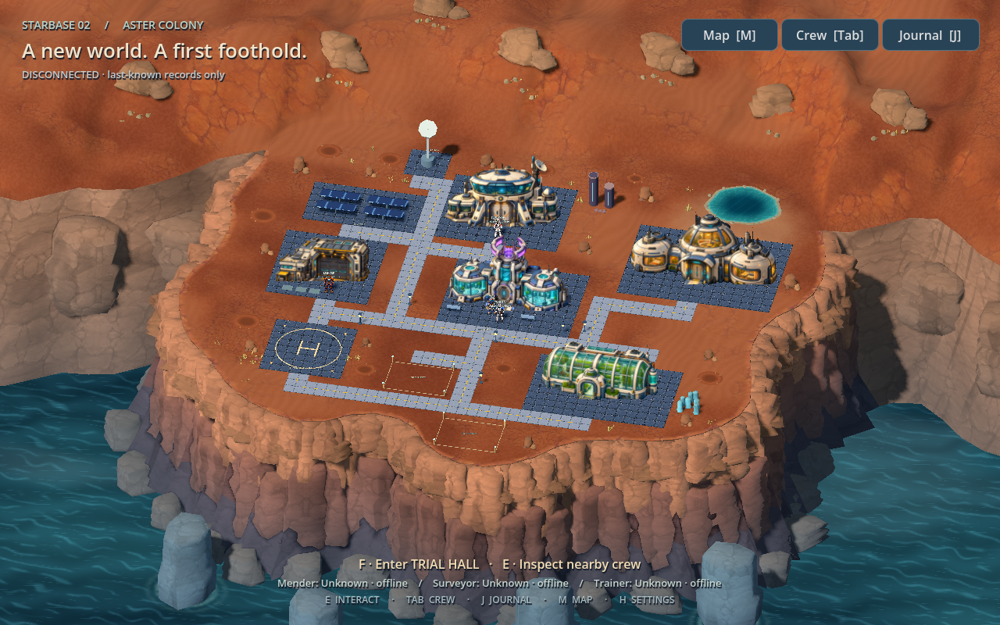
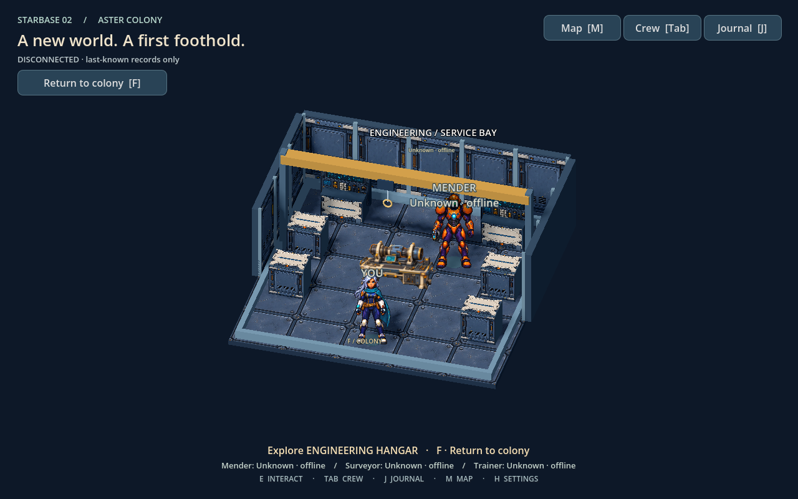

# Asset-driven colony buildings

Terminology: the [content taxonomy](content-organization.md) defines the target
`assets-production/` and `apps/world/assets/` categories. Existing paths and
commands below remain current until the coordinated migration; buildings map to
structures, while crew roles and room IDs retain their product meaning.

The [Meshy/Blender pass](meshy-blender.md) now supplies native shells and furnished
interiors for all five buildings. Gross footprints still own paving exclusion;
`navigation_bounds()` combines doorway wall segments and furniture. Persistent
rooms share world coordinates, automatic doors and Compatibility-safe cutaways.
This supersedes the detached-room presentation described in the historical
rollout below. Operational bindings and structured direct visits are preserved.

Status: accepted

Date: 2026-09-06. Scope: the authorized local hangar milestone and reusable
building workflow, followed by the five-building exterior/district rollout. No
backend or deployment behavior changes.

## Implemented

The Engineering Hangar uses an original transparent PNG exterior, a tiled service
apron beside the landing district, and an authored room with a gantry, cabinets
and illustrated repair cradle. All five colony buildings now use unique PNG
exteriors: a panoramic Survey Command bridge, a twin-chamber Trial Hall, warm
residential habitat pods, a glass hydroponic house, and the enlarged hangar. The
habitat and greenhouse moved from bespoke landscape geometry into the same
catalog. All three playable interiors compose shared scenes;
their runtime host has no building-type rendering branches.





The [building definition](../apps/world/building_definition.gd) is a Godot Resource
edited through the Inspector or its `.tres` text. Each definition contains:

- An ID and display title; exactly one PNG exterior or native exterior scene.
- For PNGs, world units per source pixel and the source pixel at the threshold.
- Collision rectangles, collision height, threshold, approach and return points.
- Foundation margins (left, back, right, front), independent of collision.
- Optional yard and interior scene paths; an interior navigation rectangle.

The [placement scene](../apps/world/buildings/colony.tscn) assigns a definition to
each shared building host. It also assigns an optional existing UI context. Art
does not determine an agent, service, permissions, health, or work state. Places
with no operational binding can have interiors with a scenery label.

One placement source now supplies both exterior rendering/physics and navigation
footprints. Definitions are shared resources, imported textures use Godot's cache,
and interiors load on entry. Static buildings do not poll or run an update loop.
Interior prop BoxShape3D bounds supply both physics and click routing; unsupported
collision shapes produce errors rather than silently becoming navigation holes.

**Tab → Visit a place** is a searchable, scrollable directory generated from the
placed buildings with interiors. It provides direct visits and keyboard focus;
the original crew inspectors and shortcuts remain available.

## Add another unique building

1. Put an original/licensed transparent PNG in `apps/world/buildings/art/`, with
   provenance. Use the same fixed exterior view (approximately 37° downward,
   12° side view), lighting and crew scale. Preserve alpha; keep shadows and
   operational indicators separate from painted art.
2. Duplicate [the hangar definition](../apps/world/buildings/definitions/repair.tres).
   Give it a unique ID/title, change its PNG path, and calibrate the threshold pixel,
   pixel size and physical footprint. Clear optional yard/interior paths if absent.
3. Add a building host node to the placement scene and assign the definition.
   Place at unit scale with no rotation; this is the supported collision/catalog
   contract. The shared paving field derives a foundation and entrance apron from
   those bounds; inspect terrain clearance and connect an authored route. Leave `interaction_kind` empty for scenery. Existing operational
   contexts must be unique; adding an operational capability is separate work.
4. For an interior, compose reusable scenes from `buildings/parts/` in the Godot
   editor. Add root Marker3D nodes named `Spawn`, `Crew`, `Console` and `Activity`.
   Keep them clear and reachable. The shared room host supplies travel, bounds,
   return controls and authoritative activity text. Use BoxShape3D prop collision.
5. Run the preview and checks below, then walk the entrance and inspect both
   camera scales. Verify painterly depth against physical bounds; alpha alone
   does not prove a correct doorway or occlusion.

```sh
mise exec -- just world-building repair
mise exec -- just world-building repair 50
mise exec -- just check-world
mise exec -- just world
```

`world-building` accepts a definition filename without `.tres`. It is an isolated
art preview with no backend connection. Close/relaunch the preview after edits.
The native scenes are the editable source; no generator is needed to rebuild
them. A new static PNG building needs artwork, a resource and a placement, with
**no new GDScript**. A new interior likewise uses ordinary scene composition.

## What the scale experiment establishes

[Catalog checks](../evidence/building-catalog/catalog-directory.log) exercise
50 unique definition IDs using shared artwork, resource reuse, no static polling,
the 50-place search list, invalid metadata, image alpha, door reachability,
interior anchors and physical collision. An unbound annex fixture also exercises
direct entry/exit without adding a role or renderer branch.

The [native 50-instance capture](../evidence/building-catalog/fifty.png) and
[measurements](../evidence/building-catalog/fifty.png.json) use **one exterior
artwork repeated 50 times**, including its yard. On this Apple M5 with Godot 4.7.2,
the 60-FPS-capped sample recorded median 16.665 ms, p95 17.724 ms and 802 draw calls.
Those are short process-frame intervals, not GPU timings or a performance
improvement claim. The fixture proves the composition path; it does not qualify
50 distinct high-resolution textures or 50 simultaneous loaded interiors.

A 1536×1024 RGBA texture with a full mip chain is approximately 8 MiB before
platform compression. Fifty unique images at that size could consume roughly
400 MiB for exterior textures alone. Before that content scale, budget source
resolution at intended zoom, measure the actual asset set, then introduce
compression or district streaming only if measurements justify it. Current
placement loads exterior art for all placed buildings; no district streaming is
implemented. Geometry yards also add draw calls independently of PNG count.

## Validation and remaining work

The world suite exercises state, terrain/navigation, room physics, interaction,
keyboard controls, reduced motion and no implicit dispatch. The first full pass
exposed a test using Mender's former hard-coded position; the retained
[failure log](../evidence/building-catalog/world-checks-first.log) shows it. The
test now uses the character's actual position. Native command fixtures retain
their local-origin, pending and uncertain-response checks.

A local Godot resource pack was built and its catalog checks run from outside
the checkout, covering lazy scene/image paths in packaged resources. This is
not a signed application or web-export qualification. Compact large-text
[stale inspection](../evidence/building-catalog/stale-compact.png) remains labeled
as fixture activity. The searchable [directory](../evidence/building-catalog/directory.png)
is separately captured at compact size.

The PNG technique is accepted for this fixed camera; it is not an explorable 3D
volume or an arbitrary-angle asset. Whole-building shadows, animated doors,
separate emission layers, and a matching alternate-angle image are not provided.
Painted screens, machinery and lights are decorative. Original PNG prompts,
generation method and SHA-256 hashes are in
[art provenance](../apps/world/buildings/art/provenance.json).

## Five-building district rollout · 2026-09-06

The colony now has a smaller central commons, Engineering beside the landing pad,
Command uphill, the Trial Hall beside the commons, and separate residential and
botanical grounds to the east. Curved paths connect the entrances. Building
footprints supply physics and click navigation from the same placement resources;
no new rendering branch or building service was added. Habitat and Botanical House
remain decorative exteriors without playable interiors or operational bindings.

| Building | Exterior identity | Ground collision footprint, metres |
|---|---|---|
| Engineering Hangar | Broad garage, utility annex, crane and service apron | 10.7 × 8.3 |
| Survey Command | Panoramic bridge, dish and offset sensor mast | 14 × 8.55 |
| Trial Hall | Paired glazed experiment chambers and violet research ring | 15 × 8.55 |
| Pioneer Habitat | Three connected residential pods with warm windows | 17.35 × 10.2 |
| Botanical House | Ribbed glasshouse, visible crops and water recycling tank | 15.8 × 7.55 |

The hangar artwork is 34% larger than the previous catalog pilot. Other structures
replace different geometry, so their footprint sizes are not a like-for-like art
scale comparison. Each was inspected beside the operator at walking zoom; the
first habitat inspection prompted another scale increase. A nearby eastern rock
was repositioned to clear its expanded footprint. The tests require unique
exterior paths and a minimum two-metre clear corridor between building footprints,
in addition to reachable approaches/returns and terrain/path clearance.
Native inspection also exposed reversed faces at tight path junctions; the shared
renderer now keeps ground triangles upward-facing. The mesh check allows measured
normal-packing precision (1.53e-5 from UP), after the initial overly strict
assertion failed; the [failure](../evidence/building-districts/path-normal-precision-failure.log)
and [probe](../evidence/building-districts/normal-probe.log) are retained.

Actual disconnected native captures: [overview](../evidence/building-districts/overview.png),
[engineering](../evidence/building-districts/workshop.png),
[command](../evidence/building-districts/commons.png),
[trials](../evidence/building-districts/gym.png),
[habitat](../evidence/building-districts/habitat.png), and
[botanical house](../evidence/building-districts/greenhouse.png).
The [capture script](../evidence/building-districts/capture.gd) uses the real scene,
operator and camera. Painted screens, crops, lights and apparatus remain scenery.

[Final world checks](../evidence/building-districts/world-final.log) cover the full
state/navigation/terrain/building/room/interaction suite; the
[native command checks](../evidence/building-districts/commands.log) preserve local
fixture origins, pending deduplication and uncertain-response reconciliation.
The [resource-pack check](../evidence/building-districts/pack-check.log) loads the
catalog outside the checkout. Native screenshots are visual verification on this
Mac; they do not establish browser, signed application or Kubernetes readiness.
The [final sample](../evidence/building-districts/validation.json) loaded all five
exteriors in the whole colony: 270 process intervals at a 60-FPS cap, median
16.657 ms and p95 17.198 ms on the Apple M5. This is not GPU timing, a performance
improvement claim, or evidence about 50 distinct textures.

The first reference-guided art generations contained painted checkerboards and
failed real-alpha inspection. They were rejected; fresh original generations
passed Godot transparency checks. Accepted source PNGs are preserved byte-for-byte
with prompts and hashes in the provenance file. Imported mipmaps are enabled.

Owner: Starbase2 world implementation, with Al reviewing the visual result. Next
art gate: harmonize interior/exterior texel density and refine grounded shadow and
entrance layers across this real five-image set. Then measure the actual next
content batch before expanding memory/loading machinery. The existing 50-host
shared-image fixture still does not qualify 50 unique finished buildings.

## Shared paving and arrival apron · 2026-09-06

The front-left white object was a decorative blockout shuttle. It has been removed,
including its navigation/physical obstacle. The arrival area is now a clearly
marked 12-metre tiled landing apron centred at `(-24, 15)`, five metres farther
forward than the former pad centre. Its northern edge has 7.45 metres of clearance
from the hangar's physical footprint. The landing area is scenery, with no arrival,
transport, resource or agent-dispatch behavior.

All five buildings, the solar field and the communications mast now sit on the
same floor material as the central commons. The
[shared paving field](../apps/world/colony_paving.gd) builds catalog-derived
foundations, front aprons, utility pads and authored walking routes on one aligned
1.5-metre tile grid. Duplicate cells at junctions are merged; there is no stacked
path/pad geometry or separate tile object. The current layout has 756 tiles in two
static meshes: illustrated floor tops and the dark joint bed. Paving is flush
scenery; existing building/terrain collision still owns movement.

Water, natural rock bounds, shallow craters and reserved construction plots are
excluded. One reserved plot moved south to clear the botanical approach. The
former hangar-specific yard overlay and central pad loops are replaced by the
shared field. Other building definitions can still use optional yard scenes for
additional props; they should not duplicate the shared floor. Future static
buildings receive foundation coverage from their existing metadata without
another rendering branch. This is a static colony field, not a district-streaming
or runtime construction system.

[Overview](../evidence/colony-paving/overview.png),
[arrival close-up](../evidence/colony-paving/arrival.png),
[commons](../evidence/colony-paving/commons.png), and
[eastern pads](../evidence/colony-paving/east.png) use the actual disconnected
native scene. The [paving test](../apps/world/test_paving.gd) checks connected
obstacle-free tile walks to every door and landing pad, terrain/plot clearance,
shared material, deduplicated upward-facing geometry, two meshes and no polling.
The interaction suite also walks through the removed shuttle footprint to detect
an invisible leftover collider.

Retained [validation](../evidence/colony-paving/validation.json) includes the full
world suite, native command fixtures and resource-pack checks outside the checkout.
The first reserved-plot exclusion exposed seven clipped route samples; the
[failure](../evidence/colony-paving/paving-reserved.log) and
[coordinate probe](../evidence/colony-paving/paving-probe.log) are retained. The
southern route was adjusted and the unchanged continuity requirement passes.
No deployment, backend state, permissions or playable interior behavior changed.

## Rectangular pads and two-tile routes · 2026-09-06

The paving layout now uses complete grid-aligned rectangles. Overlapping pads
merge into a rectangular shared court; the central commons and Trial Hall no
longer form an L-shaped foundation. Routes use only horizontal/vertical segments,
with square caps and right-angle corners. Every corridor is exactly **two tiles**
wide: three world metres with the current 1.5-metre tiles. Pads and junctions can
be wider, as expected. Bezier smoothing and radius-based tile selection are gone.

The renderer no longer removes individual tiles to work around obstacles. Full
rectangle coverage, width, connected entrances, terrain/plot clearance and cliff
bounds are checked before accepting a layout. One eastern rock moved 0.5 metres
and the crystal cluster moved three metres east to keep the habitat and botanical
pads intact. No buildings, operational bindings or permissions changed.

The [prior layout failed the orthogonal-segment check](../evidence/rectangular-paving/before-test.log).
[Final validation](../evidence/rectangular-paving/validation.json) records the world,
paving and packaged-resource checks. Actual native captures:
[overview](../evidence/rectangular-paving/overview.png),
[arrival](../evidence/rectangular-paving/arrival.png),
[central courtyard](../evidence/rectangular-paving/commons.png) and
[eastern pads](../evidence/rectangular-paving/east.png).
The shared tile field still uses two static meshes and the original floor material.

## Separate foundations and colony streets · 2026-09-06

This layout supersedes the merged central court above. All five buildings have
separate, complete dark rectangular foundations, with at least **two tiles
(three metres) of space between building pads**. The buildings, arrival apron,
utilities and several nearby terrain props moved to make that space. The
landing apron is now centred at `(-24, 19.5)`. The mineral spring and standing
stones moved north/east with their shared physical and navigation footprints.
The old low staging slabs now sit on the hangar pad, clear of the road edge.

Foundations derive from collision bounds plus per-definition `pad_margin`,
rounded outward onto the 1.5-metre grid. These margins accommodate illustrated
wings without enlarging physics. Trial Hall uses an extra right-side margin;
there is no building-specific rendering branch. Adding a building still needs
authored placement, route connection and clearance review.

Roads are light grey and exactly two tiles wide between pads, with square
junctions and right-angle turns. Yellow centre dashes are 0.9 metres long with
0.6-metre gaps on uninterrupted road segments. Markings stop at dark foundations
and leave space at junctions. Pad cells take precedence over road cells, so roads
do not cut lighter strips through a building's foundation. The floor atlas is
reused through a separate grey shader; no additional bitmap asset is required.
Four static meshes batch dark pads, grey roads, the joint bed and yellow paint.
This is decorative paving, with no traffic or transport behavior.

[Validation](../evidence/colony-streets/validation.json) retains actual checks,
including the first terrain conflict and the obsolete click target exposed by
the full scene suite. The paving check covers complete rectangles, pad spacing,
road width, material separation, paint containment, connected obstacle-free
doorways, and terrain/cliff clearance. Native disconnected captures show
[overview](../evidence/colony-streets/overview.png),
[arrival](../evidence/colony-streets/arrival.png),
[Trial Hall](../evidence/colony-streets/commons.png) and
[botanical district](../evidence/colony-streets/east.png).
Backend records, dispatch controls and deployment behavior are unchanged.

## Pad and runway lighting · 2026-09-06

[Shared paving lights](../apps/world/paving_lights.gd) derive accents from the
existing tile layout. Every pad has a continuous, steady blue perimeter with a
soft halo. Thin road outlines follow exposed outer edges; flush yellow lenses
are spaced three metres apart on straight sections. Boundaries inside road
junctions and at pad connections get no road edge fittings.

The yellow lenses pulse softly once every 2.4 seconds. **Settings → Reduced
motion** holds them fully lit; blue borders always remain steady. These are
decorative navigation accents, independent of API health, crew state or agent
activity. They introduce no collision and preserve the two-tile walking width.

Five additional batched meshes render pad cores/halos, road outlines, fixture
housings and yellow lenses. The pulse runs in a shared shader; individual lights
have no scene nodes, CPU update loops or dynamic light sources. The halo is a
local translucent surface effect, not light cast onto surrounding terrain.

The [geometry/settings test](../apps/world/test_paving_lights.gd) is part of the
world suite. Native [capture validation](../evidence/colony-edge-lights/render-check.json)
samples a real lens through its pulse and steady reduced-motion state.
[Arrival view](../evidence/colony-edge-lights/arrival.png) and
[overview](../evidence/colony-edge-lights/overview.png) show the actual disconnected
scene. No operational or deployment behavior changed.
