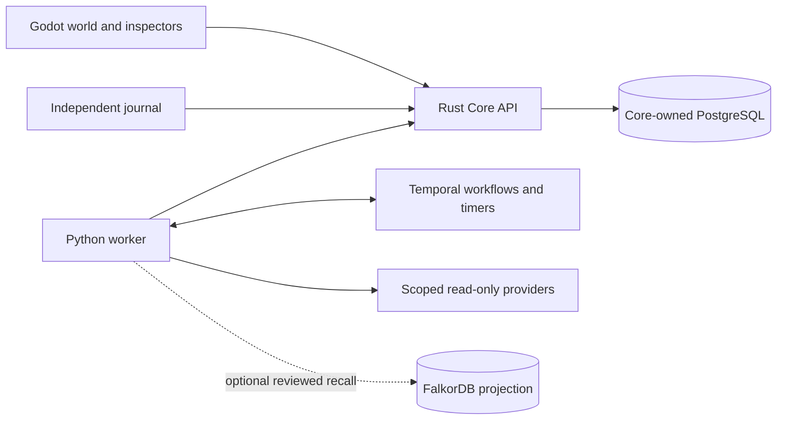

# Connect the inhabited world to autonomous work

Status: accepted

Delivered first integration slice from the approved steps 1–4; local evidence
recorded. Not every original completion criterion is met.
The subsequent native-operator slice implements step 5 workflows; final qualification
is recorded below. Step 6 now has a [deployed disposable pilot](../evidence/kubani-pilot-20260909/README.md)
with backend acceptance, actual pod replacement recovery and native Godot
workspace review verification. The [next rollout](../evidence/llm-observation-20260910/README.md) enables
manual synthetic inference and scoped Watchkeeper observation; current native
visual re-verification is tracked separately in that record.
[GitHub observation](../evidence/github-observation-20260910/README.md) is now
authenticated and verified for the selected Starbase2 repository; the first
observation had no open PRs. Durable production
recovery qualification is separate.

Owner: Al; implementation assistant owns the approved local delivery and verification.

## Outcome and review baseline

The approved first milestone makes the polished colony a truthful, useful view of work
that continues with Godot closed. Start with one bounded repository watch:
Reviewer observes changes, works at Command, and leaves evidence for inspection.
The operator can pause future observations or stop an active run from either
Godot or the independent journal. Returning the next morning shows retained
activity, coverage gaps and failures, rather than replaying an invented shift.

Reviewed [PR #1](https://github.com/X-McKay/Starbase2/pull/1), head
`f6c3cffb43766557890f0b8e988182f1ab2ad25c`, against frontend
`f8eebbf442a34be8a3e1029440610b4bd26e5cbc`. The initial review is preserved below; the implementation update records the
subsequently approved local work. The initial review did not query the cluster.
The later [read-only Kubani audit](../evidence/kubani-namespaces/current-readiness.md)
found no current Starbase2 namespace or GitOps owner; no cluster mutation was made.

## Delivered first integration slice and evidence

The initial operational slice implements these parts of steps 1–4, with bounded
local verification:

- The active/recent union retains long-running reviews, deduplicates stable IDs,
  and preserves backend kind/build/times while mapping evaluation to Trainer.
  Malformed nested records are skipped. Provider source observation time remains
  separate from Core receipt time.
- Core exposes additive installation/capability metadata; the Connection panel
  explains local/port-forward setup, disabled policy and availability. Endpoint
  switching fences unresolved writes across both clients and clears old evidence.
- Command presents active runs, bounded retained history, watch status and a
  board-window summary. This is not full native parity or a durable return briefing.
- Five crew physically reach workstations from authoritative run intent. Assignment
  selection is stable across concurrent updates; reconnect coalesces obsolete
  motion. Inspection no longer manufactures a work pose. NPC airlock opening
  leaves operator camera, position and room cutaway unchanged. Reduced motion
  and outage suppress cosmetic work; no animation dispatches a command.

The [UI evidence index](../evidence/live-world/ui/README.md) retains regression
failures, diagnoses and passing actual Godot tests. `check-02.log` records a passing
repository check. `real-03` records a real GET-only observation of the one approved
private repository with Godot closed, worker restart, duplicate identity,
changed-duplicate rejection, queued cancellation, durable pause and unchanged
retained detail across Core restart. Coverage is bounded Python analysis with
explicit unsupported-language exclusions, not repository or security certification.
Memory, inference, repairs and legacy execution were disabled in that rehearsal.

Native `native-03` captured eight live views, retained evidence, client-read outage
and reconnect with no commands dispatched. It preceded the subsequent button-layout
correction and therefore does not qualify that correction. The later frozen-source standalone `20260908-final-01` qualified with exit 0.
The [durable manifest](../evidence/live-world/package-01/manifest.json) binds every
world source, qualification runner, archive, executable and PCK; root reverified
those hashes and root/independent review inspected the corrected final live UI.
Eight exported live captures include client-read outage/reconnect with no commands
dispatched. This is not an actual provider-outage test. Owner art acceptance and
human audio audition remain separate.

## Native operator continuation

The next slice adds Operations `[R]`, reachable from any room, the crew directory
and crew inspectors. It provides explicit local review and synthetic comparison
forms using Core-reported targets and registered profiles; recurring review
creation/edit/pause/resume; and V2 history paging with active work kept separate.
The selected detail retains its fetched evidence while polling reports newer
state separately. History uses adjacent run and evidence panes at normal widths;
the return briefing has a keyboard-accessible disclosure so large text does not
crowd out the command form. Command's existing repository-watch and memory-review controls
remain the field-work surface. Stop controls stay independent of new-work policy.

Duty writes use the existing operator session transport. A lost response reconciles
against the exact requested settings and next recorded generation; a later or
mismatched revision remains uncertain and cannot trigger another POST. All three
native command clients fence endpoint changes while an outcome is unresolved.

The return briefing is explicitly bounded by the current retained snapshot.
Its last-opened time is local to the selected endpoint/installation; it never
claims a complete overnight history when records have aged out. V2 older records
are reachable through History. Field history remains the existing Command window.

Crew have static, text-and-symbol task markers for queued, active, evidence-ready,
failed, cancellation pending, cancelled and unknown work. Multiple retained runs
show a bounded set of markers and an overflow count. Reduced motion preserves
these cues. Connection shows the worker's recorded heartbeat separately from Core
receipt and provider-source timestamps, including absent/stale cases.

The [native operator evidence](../evidence/native-operations/README.md) distinguishes
focused/HTTP tests from pending or completed native/export checks. The new HTTP
journeys use an isolated synthetic Core, with no provider identity or real work.
The earlier real-provider proof remains one retained repository observation with
restart/pause/cancellation checks. Five-crew movement uses deterministic records
against actual physics; provider-failure/drift tests use synthetic adapters.

The original delivery sequence below remains as the proposal and completion gates.
No new production activation, image publication or GitHub write is claimed.

## PR review

No blocking defect was found in the changed implementation. Its timestamp
round-trip fix protects exact retry comparisons; per-architecture sandbox image
pins address the observed Linux failure; TCP database readiness avoids the
temporary initialization server. The LFS prerequisite is now diagnosed.

The independent review matched all ten recorded qualification harness hashes
and the input digest to PR source. Core/runtime implementation is unchanged
between the qualified `71ca83dd…` revision and PR head; subsequent changes
include rehearsal tooling, tests and publication evidence. These are inspected
records, not a fresh image or production qualification performed in this review.

One nonblocking documentation correction: the opening of
[the amd64 release record](https://github.com/X-McKay/Starbase2/blob/f6c3cffb43766557890f0b8e988182f1ab2ad25c/evidence/linux-release-amd64/README.md#L3-L6)
says nothing was published and calls the images private candidates, while its
publication section and JSON record confirm publication. Update the opening to
“published and verified; not activated,” or explicitly date its initial status.

At review time, both documentation CI jobs passed, the two local-runtime jobs
were still in progress, and GitHub reported the PR mergeable but unstable.
Resolve the pending checks before integration. Integrate the backend and world
branches without replacing the newer art. Prefer preserving PR ancestry so the
published image's source revision remains reachable. The subsequent approved integration retained both histories on
`codex/live-world-integration` after the PR checks passed.

The recorded images are a qualified private baseline, not an enabled field-agent
installation. The deployment generator still disables field work, memory,
inference and repairs. Image publication alone does not change those settings.

## What already exists

| Surface | Existing implementation | Work needed |
|---|---|---|
| Godot connection | One-second `/v2/snapshot` polling, `--api`, explicit offline fixtures | Connection setup, installation identity and actionable capability/health status |
| Command board | `/v4/snapshot`, observation start/stop, repository watches, memory review and evidence | Unified duty overview, per-source freshness and native command parity |
| Execution | Core-owned records; versioned Temporal workflows and recurring timers | Enable and qualify selected real targets on the intended installation |
| Crew | Live labels, inspectors and real-displacement animation | Reliable run projection and work-driven activity presentation |
| Rooms | Command, Engineering, Trial Hall and furnished social rooms | Operational panels and attention cues grounded in actual records |
| Recovery | Pending command fencing, uncertain-write GET reconciliation, retained history | Exercise these through the new native experience and exact deployment |

Sources: [world client](../apps/world/world.gd),
[state projection](../apps/world/state.gd),
[Command board](../apps/world/command_board.gd),
[command transport](../apps/world/commands.gd),
[Core routes](../services/core/src/operations_api.rs),
[field workflows](../services/runtime/starbase_runtime/field_workflow.py).

Two existing defects were reproduced in Godot 4.7.2 during this review:

- An active review outside the latest 20 records disappears from the world.
  Core supplies separate `active` and `recent` arrays; `state.gd` reads only
  `recent`. The reproduction retained 20 completed records, dropped the active
  review, and labeled Surveyor “No Findings.”
- A running backend `evaluation` does not appear under Trainer because crew and
  HUD filtering use `gym`. The reproduction produced “No recorded work” and
  zero gym-filtered records.

Both also exist on PR #1 and are integration backlog, not regressions introduced
by that PR. The temporary diagnostic invoked actual project scripts and exited
zero after confirming both behaviors; it did not call a backend. Both are now fixed with retained failing/passing regression evidence.

## Architecture to retain

Development keeps the existing SQLite/Temporal launcher. Private Kubani access
uses an operator-established local port-forward; the native client holds only
an in-memory operator session. It never receives worker, database or provider
credentials. Retain [ADR 0005](adr/0005-fresh-kubani-installation.md) and
[ADR 0006](adr/0006-field-agents-and-reviewed-memory.md).

Keep bounded polling initially. Add a small client connection/projection layer
to prevent the world, board and inspector from independently interpreting the
same records. Use existing run detail/events for evidence and transitions;
introduce streaming only if measured latency or load warrants it. Clients do
not own schedules, run truth or durable mission state.

## Delivery sequence

### 1. Integrate the baseline and repair projection

Owners: backend and world implementation, with an independent review.

- Bring PR #1 and the current world into one identified integration revision;
  retain editable assets and both evidence histories.
- Union active/recent records by stable run identity. Keep active work visible
  regardless of history churn, and provide paged history/detail inspection.
- Map domain kinds to crew/activity contexts explicitly: `evaluation` belongs
  to Trainer/Trial Hall; the backend request remains `evaluation`.
- Keep build/run identity, timestamps, retained outcome and source coverage in
  the projection. Distinguish active work from a crew member's latest result.

Completion gate: regressions cover more than 20 newer completions, duplicate records,
evaluation visibility, selection retention and concurrent runs. Contracts,
focused tests and repository checks pass on the combined revision.

### 2. Make connecting and enabling work understandable

Owners: Core contract and world implementation; can run alongside step 1.

- Add a small connection panel for local development and private port-forward
  access. Show the selected installation and distinguish fixture, live,
  disconnected, unsupported, worker-unavailable and stopped states.
- Publish an additive typed capability/installation description through Core:
  which commands are enabled, why others are unavailable, loaded builds and
  allowed targets. Do not infer permissions from empty result arrays.
- Show snapshot receipt freshness separately from provider observation age and
  worker heartbeat. An available worker does not prove a monitored target is
  healthy. Retain explicit partial, no-change and unknown states.
- Reuse session and write-reconciliation behavior. A restart or timeout must
  reconcile the existing command identity rather than submit another run.

Completion gate: no-core cold start, absent worker, disabled field work, expired session,
malformed/additive snapshots, transport loss and reconnect all have accurate
UI and command behavior. Existing clients tolerate the additive contract.

### 3. Deliver one real autonomous loop locally

Owners: runtime and world implementation, with a separate QA reviewer.

- Configure one approved repository watch using the existing V4 workflow and
  read-only adapter. Enable field work locally, with memory and inference off;
  recurring analysis needs no graph, new model budget or general-purpose agent
  loop. An empty recall result alone does not identify whether memory is enabled;
  use the capability metadata for that distinction.
- Show last/next observation, interval, paused/busy/overdue status, active runs,
  retained findings and coverage. Reuse existing watch generation checks.
- Keep pause distinct from stop: pause prevents future dispatch; existing work
  remains visible and separately cancellable.
- Preserve the current coverage limits: up to ten recent open PRs, bounded
  Python content, and explicit exclusions. “No findings” is not a certification
  of every PR, language or security property.

Completion gate: with Godot closed, the timer produces a retained observation. Reopening
shows the same IDs/evidence as the journal. Worker replacement, duplicate
delivery, provider failure, target revision drift, pause and cancellation remain
inspectable without duplicate logical work. First establish this loop locally;
it does not wait for production backup work.

### 4. Give actual work a visible place in the colony

Owner: world implementation, alongside runtime qualification after step 1.

Add a small per-crew presentation controller driven by supported backend state
and stable run identity. Its movement is a depiction of work already started;
arrival never starts, delays or finishes a workflow. Do not invent detailed
“thinking” phases the backend does not record.

| Authoritative observation | World presentation | Inspectable information |
|---|---|---|
| Queued assignment | Assignment marker and optional travel toward workstation | Run, target, build, queued time |
| Running | Work pose or instrument activity at the appropriate station | Current recorded phase/detail, observation time, active-run count |
| Retained completion | Evidence-ready marker | Findings/no-change/result, coverage and source links |
| Failed or cancellation pending | Distinct text/icon attention cue | Failure or pending acknowledgement, available recovery action |
| Stale/disconnected | Last-known/unknown cue; suppress confident work/success presentation | Last receipt and observation time |

Reviewer and Watchkeeper use Command; Surveyor uses its desk; Trainer uses the
paired Trial Hall stations. Engineering presents Mender only when that
capability is enabled and clearly identifies synthetic practice. Habitat and
Botanical remain ambient social/scenic spaces; they do not invent resource,
wellbeing or infrastructure telemetry.

One crew identity may have several runs: show task markers/counts and choose a
stable visible assignment. Duplicate snapshots cannot restart motion; reconnect
coalesces obsolete transitions while history stays available. Short runs may
complete before a character arrives; show their completed evidence immediately.

Completion gate: native run/stop/turn/arrival journeys match real state through reconnect,
concurrency and fast completion. Reduced motion has equivalent information;
default-muted sound stays optional. Evidence is reachable in at most three
interactions, and keyboard/journal controls remain independently usable.

### 5. Complete operator workflows and the return-to-colony experience

Owner: world/contract implementation.

Scope carried forward from the original steps 1–4:

- Native history pagination: complete when records beyond the recent window can
  be paged and inspected without hiding active work or disturbing selection.
  The independent journal remains the current history fallback.
- Distinct spatial assignment/evidence markers: complete when queued, active,
  evidence-ready, unknown and failure cues remain distinguishable at normal and
  compact scales, with equivalent text and reduced-motion behavior. Existing
  labels/counts/inspectors provide the initial operational slice.
- Separate worker-heartbeat timestamp: complete when the panel labels worker
  observation time independently from Core receipt and provider-source time,
  including absent/stale cases. Worker availability alone is not target health.

- Extend existing native controls for review/evaluation and duty management
  where they currently defer to the journal, using the same backend commands.
- Add a concise return briefing derived from retained runs: completed work,
  failures, missed/overdue observations and items awaiting operator review.
  Use real timestamps and IDs; do not fabricate a chronological shift narrative.
- Keep active-task stop available globally. Show evidence, exact builds and
  permissions separately from cosmetic XP. Retain journal feature parity.

Completion gate: start/inspect/stop and watch-management journeys work spatially and through
structured keyboard controls; pending, denied and uncertain writes never appear
accepted merely because a button or animation completed.

### 6. Activate and qualify the private always-on installation

Owner: Kubani platform/release owner, with runtime support. Preparation can run
in parallel; actual activation follows a separately authorized Kubani change.

- Verify the current target and publication records; render the exact stopped
  bundle with immutable qualified digests. If backend/runtime inputs change,
  build and qualify new images rather than relabel the old qualification.
- Follow [deployment](deployment.md): dedicated PostgreSQL roles/schema and
  Temporal namespace, migration/grants, image identity, recovery and external
  emergency stop. Resolve the independent backup-key/restore gate before
  accepting production work, as recorded in PR #1's roadmap backlog.
- Enable one repository duty explicitly. Add target configuration, narrowly
  scoped credentials and required egress; the present generator's hardcoded
  disabled field flags must become a reviewed capability configuration.
- Add Watchkeeper afterward for one approved namespace/workload scope with
  read-only RBAC. No mutation/publication permissions are implied by observing.
- Memory can remain disabled for the first useful loop. Enable the optional
  reviewed-memory projection only with its graph access, approval, revocation,
  rebuild and outage qualification complete.

Completion gate: the exact deployed revision runs overnight with Godot closed, survives
worker replacement, exposes stale/provider-failure states and retains evidence.
Native and journal views agree after reconnect. Pause, stop, backup restore and
out-of-band recovery work on the intended installation. Record observed scope
and duration; local image rehearsal alone does not satisfy this gate.

## Verification and boundaries

Run focused state/command regressions first, then affected Core/runtime
integration checks, `just check` and `just check-world`. Exercise real
Core/Temporal with synthetic providers for deterministic failure cases, then an
explicitly selected read-only live target for provider qualification. Do not use
paid pilots as an implicit frontend test.

Extend native export qualification with a controlled live backend mode in
addition to the existing offline fixture checks. Capture the same assignment,
evidence, outage and reconnect journeys in the actual standalone app. Keep
the frontend revision and backend image/contract identities in the evidence.
Measure poll payload/latency, frame time during updates and command-to-visible
state before claiming improved responsiveness.

Immediate delivery scope excludes public ingress, web export, general coding
repairs, GitHub publication, cluster changes by agents, autonomous memory
promotion and new Scout/Warden abilities. Those need their own bounded
capability implementations and qualification. None is required to make the
existing read-only autonomous crew useful and visible.

The originally recommended first handoff was steps 1–4 with one demonstrated real
repository loop and the polished native world. The delivered first integration
slice has the explicit carried-forward items above. Steps 5–6 complete operator parity and the
always-on installation. This keeps visual progress and infrastructure work
parallel while giving each milestone an observable completion condition.
