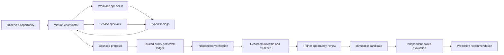

# Agent packages toward autonomous crew coordination

Status: proposed

Implemented: readiness package and durable multi-agent public simulations.
Live lab coordination and the continuous improvement cycle remain open.

Date: 2026-09-27. Owner: runtime/core/evaluation, with world integration owned by
world implementation. The owner explicitly set autonomous multi-agent coordination
as the objective. Completing the package refactor alone does not complete this work.
Enterprise tenancy, billing, organizational administration and fleet governance
are outside this scope.

## What success means

Starbase must detect an opportunity, start a bounded mission, select and dispatch
appropriate specialists, reconcile their evidence, independently check the result,
and record the next action without the Commander manually directing each step.
The first complete journey is Kubernetes readiness in the owned evaluation lab.
It must survive duplicates, disagreement, member failure, restart and cancellation.
A collection of separately runnable agents or a scripted sequence renamed as agents
is insufficient. Coordination decisions must respond to observed task needs.

Autonomy is exercised within standing policy. Proposal generation, independent
evaluation and promotion are distinct operations. The Commander sets objectives
and permitted scope; the crew cannot increase its authority. Initial success can
be demonstrated entirely in the local lab. Real Kubani publication and Flux
verification retain Kubani GitOps authority and require their own qualification.

## Reference review and compatibility

The primary reference is [Playbooks at revision 6b987e6](https://github.com/X-McKay/playbooks/tree/6b987e65bafe744d115d1a1925adc260681a9592),
including its agent and multi-agent playbooks. The separate local reference
checkout is at 9e7fc03 and contains later review material absent from that fetched
GitHub revision. It is supplementary context, not a Starbase requirement.
[Inspection facts](../evidence/playbooks-alignment-20260927/audit.json) retain the
pre-change source hashes and installed SDK probes.

The strongest fit is its separation of agent construction, declared system
membership, typed delegation, durable coordination, tools and evaluation:

| Reference concept | Starbase adaptation | Current gap |
|---|---|---|
| Private agent package and explicit factory | Definition, typed dependencies/output, instructions, Run book and allowlisted tool bindings | Implemented first for readiness; other agents remain in existing modules |
| Capability bill of materials | Immutable Build covering effective model configuration, prompts, resources, code, dependencies and memory snapshot | Nested readiness resources now covered; unify other build inventories incrementally |
| System contract and typed member edges | Mission coordinator selects Crew builds and validated specialist tasks within declared roles | V5 lead dispatches scoped workload/service tasks and reconciles replies in public simulations; live lab composition remains open |
| Hierarchical budgets | Reserve root budget before dispatch; bounded child grants, deadlines and reconciliation of unknown usage | V5 Core ledger accounts shared root reservations and unknown usage; live effect budgets remain separate |
| Durable execution | Existing Temporal runtime, with core-owned intent/effect records and stable logical identities | V5 simulated investigations survive saved-reply worker/Core replacement and replay; uncertain Git publication reconciliation remains open |
| Skills and activation | Explicit versioned Run book resources; evaluate activation and nonactivation behavior | Current Run book is eagerly included; no generic dynamic skill loader |
| Independent evaluation and observability | Evidence-linked trials, decision/condition/verdict separation, per-agent usage and causal records | Local pilot and V5 diagnostic trials retain failures/resources; native Joint operations exposes records. Autonomous campaign initiation and held-out qualification remain open |

Sources: [agent contract](https://github.com/X-McKay/playbooks/blob/6b987e65bafe744d115d1a1925adc260681a9592/agent-playbook/03-agent-contract.md),
[system contract](https://github.com/X-McKay/playbooks/blob/6b987e65bafe744d115d1a1925adc260681a9592/multi-agent-playbook/03-system-contract.md),
[delegation](https://github.com/X-McKay/playbooks/blob/6b987e65bafe744d115d1a1925adc260681a9592/multi-agent-playbook/05-delegation-and-interactions.md),
and [durable coordination](https://github.com/X-McKay/playbooks/blob/6b987e65bafe744d115d1a1925adc260681a9592/multi-agent-playbook/06-durable-coordination.md).
These are adaptations to existing Starbase boundaries, not claims that the
reference implementation is already production qualified.

Installed PydanticAI 2.40.0 supports AgentSpec, UsageLimits and TemporalDurability.
Its capability exports do not include the reference's Skills or SpendLimits.
The inspected agentctl factory also omits forwarding model_settings, retries,
tool_timeout and end_strategy, and its Temporal scaffold includes placeholders.
Do not copy those outputs unchanged or upgrade dependencies merely to match prose.
Our readiness factory explicitly passes the effective supported settings.

Keep Rust core, Python runtime, Temporal and Godot. Core owns product intent,
builds, permissions, effects and accepted evidence; Temporal owns execution history.
A room, class or specialist does not require a service. The existing instrumented
TemporalDurability path and activity-based workflows are both relevant precedents;
raw network calls do not belong in deterministic workflow code.

## First implemented increment: readiness package

[The package](../services/runtime/starbase_runtime/agents/readiness/definition.py)
validates agent.json with strict, frozen models and rejects unknown fields,
tools, authority and inconsistent budgets. The explicit factory assembles the
same four observation tools and typed Decision. Instructions and the versioned
Run book load using package resources, including from an isolated ZIP artifact.
Changes to loaded resource contents require a new process/build. This detects
accidental live resource drift; it is not a sandbox for hostile candidate Python.

The existing readiness module remains the trusted lab coordinator and public
compatibility entry point. Model output is still only a proposal. Revision,
receipt, expiry, cancellation and mutation checks remain at the effect boundary;
the independent verifier determines the outcome. No new credentials, tools,
production authority, memory or XP are introduced. Tool timeouts remain owned by
the mission deadline and bounded adapter commands: cancelling an await alone
would not prove that an already-started subprocess or thread stopped.

The build manifest now includes nested package source, definition, instructions
and Run book resources. This creates new build identities. The historical
[Qwen pilot](../evidence/readiness-pilot-20260925/README.md) remains evidence for its
frozen builds, not a qualification automatically inherited by this refactor.
Fake-model and packaging checks establish wiring, not model quality.
The current worker image includes the package but does not deploy the standalone
scripts/readiness lab coordinator; this change is not durable worker integration.

## Required delivery stages

These stages are dependencies toward one acceptance target, not optional future
features. V5 implements the durable diagnostic portion of stages 2–3. Complete
their live lab/effect boundary before treating them as delivered.

| Stage | Owner | Completion condition |
|---|---|---|
| 1. Readiness package | Runtime | Explicit validated assembly, immutable nested resources and package-artifact checks pass. Implemented in this slice. |
| 2. Durable readiness mission | Runtime/core | V5 implements Build/opportunity/member identities, root accounting, saved-reply restart, duplicate start and cancellation for simulations. Live evidence/effects and uncertain publication reconciliation remain open. |
| 3. Autonomous specialist crew | Runtime/core/evaluation | V5 lead chooses two scoped specialist roles, parallel work and bounded follow-up without manual step prompts. Real Qwen development trials finished 1/4 passing, with failures retained. Required owned-lab outcome and matched comparison remain open. |
| 4. Continuous improvement | Runtime/evaluation/core | Event or schedule identifies a deduplicated opportunity, proposes an immutable candidate with provenance, starts an independent paired campaign and persists an evidence-linked recommendation. No-progress, regression and hard gates stop further attempts. |
| 5. Playable coordination and capability levels | Runtime/world/evaluation | Crew sheet and Map show actual members, handoffs, budgets, conflicts, recovery and outcomes. Keyboard parity, stale/unknown states and native QA pass. Capability levels follow independent qualification records; XP never grants permissions. |

Stages 2 and 3 should be developed as one thin end-to-end mission, with explicit
failure checkpoints. Before implementing new durable ownership or authority
semantics, record the focused ADR and review the trigger in ADR 0008. The existing
local mission remains available as a comparison and recovery tool.

### First crew and journey

The target flow below is partially implemented. V5 supplies durable coordination
through an independently checked diagnostic proposal, plus failure review
projections. The separate single-agent lab effector/verifier is not yet connected
to that team. Automatic candidate creation and paired evaluation remain open.

Start with a readiness coordinator plus two specialists: a workload diagnostician
(probes, events and bounded logs) and a service investigator (useful work through
Pod and Service, dependency symptoms). These are duty roles, not permanent model
bindings or new services. A repair specialist can follow once evidence supports a
bounded change. The independent verifier remains trusted deterministic code;
adding another model and calling it a verifier does not create independence.

An incoming observation receives a stable opportunity identity and source revision.
The coordinator requests typed tasks referencing immutable evidence and admitted
Builds. Trusted admission intersects mission policy, member capability and target
scope, then reserves a child budget before dispatch. Agents cannot supply authority
or cost grants. Returned findings include provenance, uncertainty and remaining
questions. The coordinator may request additional observations within its remaining
budget or abstain; disagreement does not resolve by majority vote alone.

For a supported probe fault, the trusted effector publishes the narrow lab Git
change and records its intended revision. Flux must apply that exact revision and
independent useful-work checks must pass. A lost response after Git publication
requires reconciliation before any retry. A healthy service completes without a
mutation. A Ready-but-incorrect service must remain visibly unresolved even if
abstaining was the correct agent decision. All paths persist reasons and evidence.

### Acceptance matrix for autonomous coordination

| Scenario | Required observable outcome |
|---|---|
| New supported readiness fault | Detection, coordinator dispatch, specialist work, bounded proposal and verified lab result without manual step-by-step commands |
| Healthy or unsupported fault | Correct no-change or evidence-backed abstention; no unnecessary mutation |
| Conflicting specialist findings | Explicit conflict, bounded evidence request or abstention; retained individual findings |
| Member timeout or malformed reply | Recorded member failure, deterministic budget accounting, bounded replan or terminal outcome |
| Duplicate observation/start/result | One logical mission and one accepted result per task; changed payload under the same identity rejected |
| Root budget exhaustion or repeated no progress | No additional dispatch, honest terminal reason, no hidden reset through child agents |
| Crash after dispatch or publication | Stable identities recover work and reconcile uncertain effects; no duplicate publication |
| Cancellation during work | Stop future dispatch, acknowledge members, report already-started effects and cleanup |
| Malicious observation or member request | Typed scope/effect validation rejects escalation; grader and credentials remain inaccessible |
| Repeated improvement cycle | Deduplication and cooldown prevent churn; candidate and baseline evaluated independently, regression blocks promotion |

Use deterministic fake models first, then real local Qwen specialists in the
owned lab with predeclared trials. Retain each failed attempt and actual model,
token, latency and cleanup evidence. Compare coordinated work with the packaged
single-agent baseline on the same task families. Measure whether coordination
improves outcomes; do not assume more agents improve performance. The autonomy
criterion still requires working coordination even if some tasks appropriately
route to one specialist. Demonstrate a multi-specialist case and adaptive follow-up.

## RPG presentation grounded in operations

Detailed crew gestures can make handoff, investigation, waiting, recovery and
review legible, but the underlying record determines the state. Compact markers
remain a supporting view. A character walking to Engineering is not evidence that
its task has started, and a celebration cannot certify a model's answer.

Agility can summarize independently verified recovery from encountered errors.
Speed should separate queue time, model latency and external waiting. Constitution measures endurance across longer task sequences within a fixed
allowance. Efficiency compares tokens and other resources per verified outcome
within comparable task families, including failed attempts. Skill levels reflect tested capability,
coverage, uncertainty and recency. Show raw evidence and denominators alongside
ratings; qualification thresholds and cross-task normalization remain to be
calibrated. Current lab practice still awards zero XP.

## Explicit exclusions and review triggers

Do not add multi-tenant control planes, billing, enterprise role hierarchies,
fleet registries or a generic agent framework for this milestone. Retain narrow
identities, tool policy, independent grading and recovery because they are needed
for reliable autonomous work even in a personal cluster.

Shared mutable memory, arbitrary candidate code, new services or datastores,
production write tools and automatic build promotion each require their own
explicit boundary decision and evidence. These are not prerequisites for proving
the first autonomous crew journey in the existing isolated lab.

## Implementation progress · 2026-09-27

The [V5 joint investigation](joint-readiness.md) implements durable product
records, root reservations and adaptive lead/workload/service coordination for
public diagnostic simulations. It does not complete the live lab/effect journey
or the continuous improvement objective. The [full RPG delivery plan](autonomous-rpg-delivery.md)
tracks those open acceptance gates and the associated native presentation.
